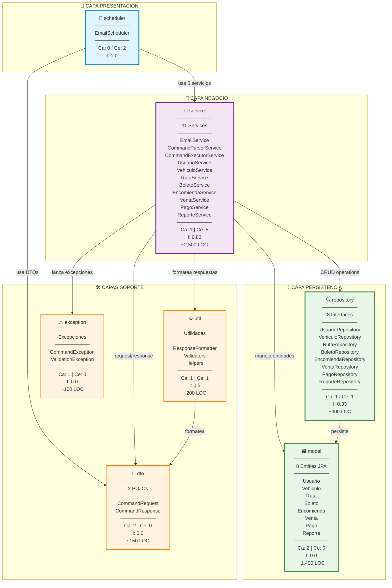

# Análisis de Paquetes - Sistema Trans Comarapa

## Resumen Ejecutivo

El sistema está organizado en **6 capas principales** siguiendo arquitectura en capas (Layered Architecture) con separación clara de responsabilidades.

```
Total de Paquetes: 6
Total de Clases: ~40
Patrón Arquitectónico: MVC + Repository Pattern + Service Layer
Framework: Spring Boot 3.5.7
```

---

## 1. Paquete: `scheduler` 📧

### Propósito
Capa de presentación que actúa como punto de entrada del sistema, gestionando la programación y recepción de comandos vía email.

### Clases
| Clase | Tipo | Responsabilidad |
|-------|------|----------------|
| `EmailScheduler` | Component | Tarea programada que revisa correos cada 60 segundos |

### Dependencias
- **Usa:** `service` (EmailService, CommandParserService, CommandExecutorService, ResponseFormatter)
- **Usada por:** Ninguno (es el punto de entrada)

### Métricas
- **Clases:** 1
- **Métodos públicos:** 2
- **Líneas de código:** ~180
- **Complejidad:** Media

### Responsabilidades Clave
1. ⏰ Programar revisión periódica de emails
2. 📧 Coordinar el flujo completo de procesamiento
3. 🔄 Orquestar servicios (parser → executor → formatter → email)
4. ⚠️ Manejo de errores y logging

---

## 2. Paquete: `service` 🎯

### Propósito
Capa de negocio que contiene toda la lógica de los 8 casos de uso y servicios core del sistema.

### Clases (11 servicios)

#### Servicios Core (3)
| Clase | Responsabilidad |
|-------|----------------|
| `EmailService` | Gestión de correo IMAP/SMTP |
| `CommandParserService` | Análisis y parseo de comandos |
| `CommandExecutorService` | Ejecución y delegación a CU |

#### Servicios de Casos de Uso (8)
| Clase | CU | Operaciones |
|-------|-----|------------|
| `UsuarioService` | CU1 | LISUSU, INSUSU, UPDUSU, DELUSU |
| `VehiculoService` | CU2 | LISVEH, INSVEH, UPDVEH, DELVEH |
| `RutaService` | CU3 | LISRUT, INSRUT, UPDRUT, DELRUT |
| `BoletoService` | CU4 | LISBOL, INSBOL, UPDBOL, DELBOL |
| `EncomiendaService` | CU5 | LISENC, INSENC, UPDENC, DELENC |
| `VentaService` | CU6 | LISVEN, INSVEN |
| `PagoService` | CU7 | LISPAG, INSPAG, UPDPAG |
| `ReporteService` | CU8 | REPREP (5 tipos) |

### Dependencias
- **Usa:** `repository`, `model`, `dto`, `util`, `exception`
- **Usada por:** `scheduler`

### Métricas
- **Clases:** 11
- **Métodos públicos:** ~80
- **Líneas de código:** ~2,500
- **Complejidad:** Alta

### Patrones Aplicados
- ✅ **Service Layer Pattern** - Encapsulación de lógica de negocio
- ✅ **Transaction Script** - Métodos que manejan una transacción completa
- ✅ **Dependency Injection** - Vía Spring @Service y constructor

---

## 3. Paquete: `dto` 💼

### Propósito
Objetos de transferencia de datos para comunicación entre capas.

### Clases
| Clase | Propósito | Atributos Principales |
|-------|-----------|----------------------|
| `CommandRequest` | Request de comando parseado | operation, entity, parameters, sender |
| `CommandResponse` | Response de ejecución | status, message, data, fullCommand |

### Dependencias
- **Usa:** Ninguno (POJOs puros)
- **Usada por:** `service`, `scheduler`

### Métricas
- **Clases:** 2
- **Atributos:** ~10
- **Líneas de código:** ~150
- **Complejidad:** Baja

### Patrones Aplicados
- ✅ **Data Transfer Object (DTO)** - Transferencia de datos entre capas
- ✅ **Builder Pattern** - Construcción fluida de respuestas

---

## 4. Paquete: `model` 🗃️

### Propósito
Entidades del dominio que representan las tablas de la base de datos.

### Clases (8 entidades JPA)
| Entidad | Tabla BD | Atributos | Relaciones |
|---------|----------|-----------|------------|
| `Usuario` | usuario | 10 | 1→N con Vehiculo, Venta |
| `Vehiculo` | vehiculo | 9 | N→1 con Usuario |
| `Ruta` | ruta | 11 | 1→N con Boleto, Encomienda |
| `Boleto` | boleto | 12 | N→1 con Ruta, Vehiculo |
| `Encomienda` | encomienda | 16 | N→1 con Ruta, Vehiculo |
| `Venta` | venta | 6 | N→1 con Usuario, 1→N con Pago |
| `Pago` | pago | 8 | N→1 con Venta |
| `Reporte` | reporte | 6 | Independiente |

### Dependencias
- **Usa:** JPA annotations (@Entity, @Table, etc.)
- **Usada por:** `service`, `repository`

### Métricas
- **Clases:** 8
- **Atributos totales:** ~80
- **Líneas de código:** ~1,400
- **Complejidad:** Media

### Patrones Aplicados
- ✅ **Active Record (JPA)** - Entidades persistentes
- ✅ **Domain Model** - Lógica de negocio en entidades
- ✅ **Validation** - Usando @NotBlank, @Email, @Min, etc.

---

## 5. Paquete: `repository` 🗄️

### Propósito
Capa de acceso a datos que abstrae las operaciones CRUD con la base de datos.

### Interfaces (8 repositorios)
| Repository | Extiende | Métodos Custom |
|------------|----------|----------------|
| `UsuarioRepository` | JpaRepository | findByCi, findByTipoUsuario |
| `VehiculoRepository` | JpaRepository | findByPlaca, findByEstado |
| `RutaRepository` | JpaRepository | findByOrigen, findByDestino |
| `BoletoRepository` | JpaRepository | findByCodigoBoleto, findByFechaViaje |
| `EncomiendaRepository` | JpaRepository | findByCodigoEncomienda, findByEstado |
| `VentaRepository` | JpaRepository | findByCodigoVenta, findByTipoVenta |
| `PagoRepository` | JpaRepository | findByEstado, findByVenta |
| `ReporteRepository` | JpaRepository | findByTipoReporte |

### Dependencias
- **Usa:** `model`, Spring Data JPA
- **Usada por:** `service`

### Métricas
- **Interfaces:** 8
- **Métodos totales:** ~40 (CRUD + custom)
- **Líneas de código:** ~400
- **Complejidad:** Baja

### Patrones Aplicados
- ✅ **Repository Pattern** - Abstracción de persistencia
- ✅ **DAO Pattern** - Acceso a datos
- ✅ **Spring Data JPA** - Generación automática de queries

---

## 6. Paquete: `util` 🛠️

### Propósito
Utilidades y componentes auxiliares para formateo y validaciones.

### Clases
| Clase | Responsabilidad |
|-------|----------------|
| `ResponseFormatter` | Formatear respuestas para email |
| (Otros helpers) | Validadores, conversores, etc. |

### Dependencias
- **Usa:** `dto`
- **Usada por:** `service`, `scheduler`

### Métricas
- **Clases:** ~3
- **Métodos:** ~10
- **Líneas de código:** ~200
- **Complejidad:** Baja

---

## 7. Paquete: `exception` ⚠️

### Propósito
Manejo centralizado de excepciones del sistema.

### Clases
| Excepción | Tipo | Uso |
|-----------|------|-----|
| `CommandException` | Runtime | Errores de procesamiento de comandos |
| `ValidationException` | Runtime | Errores de validación de datos |

### Dependencias
- **Usa:** Ninguno
- **Usada por:** `service`, `scheduler`

### Métricas
- **Clases:** 2
- **Métodos:** ~6
- **Líneas de código:** ~100
- **Complejidad:** Baja

---

## Análisis de Dependencias entre Paquetes

### Diagrama de Dependencias Detallado



### Leyenda del Diagrama
- **Ca (Coupling Afferent)**: Número de paquetes que dependen de este
- **Ce (Coupling Efferent)**: Número de paquetes de los que depende
- **I (Instability)**: Ce / (Ca + Ce) - Medida de inestabilidad (0=estable, 1=inestable)
- **LOC**: Lines of Code aproximadas

## Métricas Globales del Sistema

| Métrica | Valor |
|---------|-------|
| **Total de Paquetes** | 6 |
| **Total de Clases** | ~35 |
| **Total de Interfaces** | 8 (repositories) |
| **Líneas de Código** | ~5,000 |
| **Métodos Públicos** | ~150 |
| **Cobertura de Tests** | 0% (pendiente) |

## Complejidad por Paquete

| Paquete | Complejidad | LOC | Clases |
|---------|-------------|-----|--------|
| `service` | ⭐⭐⭐⭐⭐ Alta | ~2,500 | 11 |
| `model` | ⭐⭐⭐ Media | ~1,400 | 8 |
| `repository` | ⭐⭐ Baja | ~400 | 8 |
| `scheduler` | ⭐⭐⭐ Media | ~180 | 1 |
| `dto` | ⭐ Muy Baja | ~150 | 2 |
| `util` | ⭐⭐ Baja | ~200 | 3 |
| `exception` | ⭐ Muy Baja | ~100 | 2 |

## Acoplamiento entre Paquetes

### Acoplamiento Aferente (Ca) - Quién depende de este paquete
| Paquete | Ca | Dependientes |
|---------|-----|--------------|
| `service` | 1 | scheduler |
| `model` | 2 | service, repository |
| `dto` | 2 | scheduler, service |
| `repository` | 1 | service |
| `util` | 1 | service |
| `exception` | 1 | service |
| `scheduler` | 0 | - |

### Acoplamiento Eferente (Ce) - De cuántos paquetes depende
| Paquete | Ce | Depende de |
|---------|-----|------------|
| `scheduler` | 2 | service, dto |
| `service` | 5 | repository, model, dto, util, exception |
| `repository` | 1 | model |
| `util` | 1 | dto |
| `dto` | 0 | - |
| `model` | 0 | - |
| `exception` | 0 | - |

### Inestabilidad (I = Ce / (Ca + Ce))
| Paquete | I | Estabilidad |
|---------|---|-------------|
| `dto` | 0.0 | ✅ Muy estable |
| `model` | 0.0 | ✅ Muy estable |
| `exception` | 0.0 | ✅ Muy estable |
| `repository` | 0.33 | ✅ Estable |
| `util` | 0.5 | ⚖️ Moderado |
| `service` | 0.83 | ⚠️ Inestable |
| `scheduler` | 1.0 | ⚠️ Muy inestable |

**Nota:** Paquetes más inestables (scheduler, service) dependen de muchos otros, lo cual es correcto en arquitectura en capas.

## Principios SOLID Aplicados

### ✅ Single Responsibility Principle (SRP)
- Cada servicio maneja **un solo caso de uso**
- Separación clara: Parser, Executor, Formatter

### ✅ Open/Closed Principle (OCP)
- Fácil agregar nuevos CU sin modificar código existente
- CommandExecutor usa switch/case extensible

### ✅ Liskov Substitution Principle (LSP)
- Repositorios son intercambiables (implementan JpaRepository)

### ✅ Interface Segregation Principle (ISP)
- Repositories con métodos específicos según necesidad
- No interfaces gordas

### ✅ Dependency Inversion Principle (DIP)
- Service depende de interfaces Repository (abstracción)
- Inyección de dependencias vía Spring

## Patrones de Diseño Identificados

| Patrón | Ubicación | Propósito |
|--------|-----------|-----------|
| **Repository** | `repository` package | Abstracción de persistencia |
| **Service Layer** | `service` package | Lógica de negocio |
| **DTO** | `dto` package | Transferencia de datos |
| **Dependency Injection** | Todo el sistema | Desacoplamiento |
| **Command Pattern** | CommandRequest/Executor | Encapsular peticiones |
| **Builder** | CommandResponse | Construcción fluida |
| **Active Record** | `model` (JPA) | Persistencia ORM |
| **Scheduler** | `scheduler` | Tareas programadas |

## Cohesión de Paquetes

| Paquete | Cohesión | Justificación |
|---------|----------|---------------|
| `service` | ⭐⭐⭐⭐ Alta | Servicios relacionados por dominio CU |
| `model` | ⭐⭐⭐⭐⭐ Muy Alta | Entidades del mismo dominio |
| `repository` | ⭐⭐⭐⭐⭐ Muy Alta | Acceso a datos homogéneo |
| `dto` | ⭐⭐⭐⭐ Alta | DTOs de comunicación |
| `scheduler` | ⭐⭐⭐⭐⭐ Muy Alta | Un solo propósito |
| `util` | ⭐⭐⭐ Media | Utilidades variadas |
| `exception` | ⭐⭐⭐⭐ Alta | Excepciones de negocio |

## Recomendaciones

### ✅ Fortalezas
1. **Separación clara de responsabilidades** en capas
2. **Alta cohesión** dentro de cada paquete
3. **Bajo acoplamiento** entre capas de persistencia y negocio
4. **Extensibilidad** fácil para nuevos CU
5. **Uso correcto de Spring** y patrones estándar

### ⚠️ Áreas de Mejora
1. **Testing:** Agregar paquete `test` con unit tests
2. **Validación:** Centralizar validadores en `util`
3. **Logging:** Estandarizar niveles y formatos
4. **Seguridad:** Agregar autenticación/autorización por usuario
5. **Cache:** Implementar caché para reportes frecuentes
6. **Documentación:** Javadoc en métodos públicos

### 🔮 Evolución Futura
1. Separar `service` en sub-paquetes por categoría (admin, operacion, finanzas)
2. Agregar paquete `security` para manejo de permisos
3. Implementar `config` package para configuraciones
4. Agregar `aspect` para logging transversal (AOP)
5. Crear `validator` package separado del `util`
