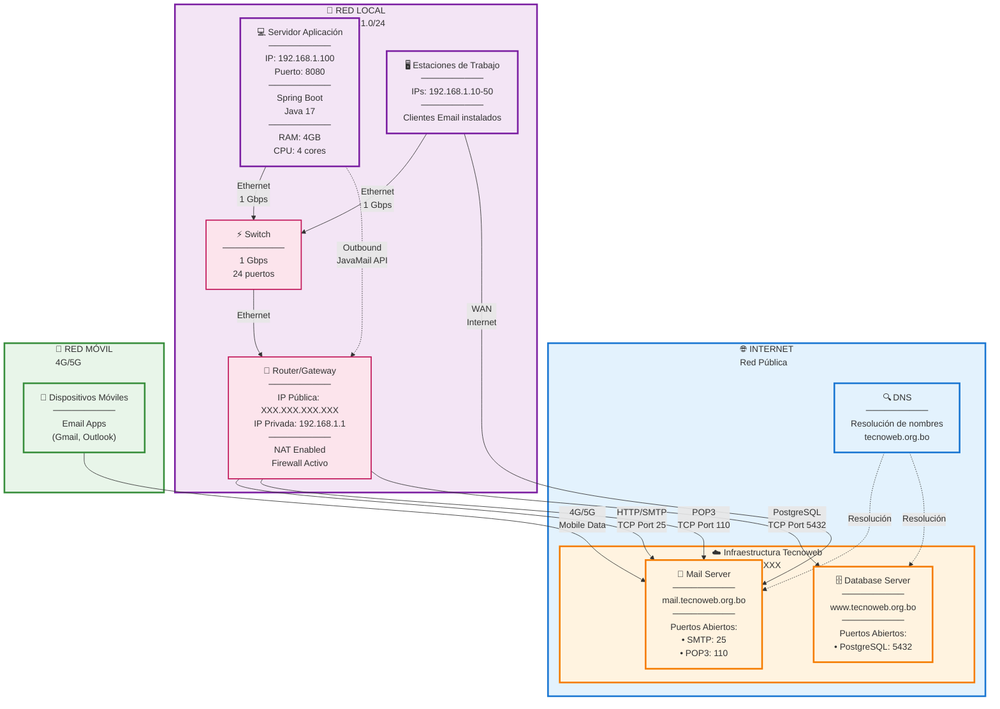
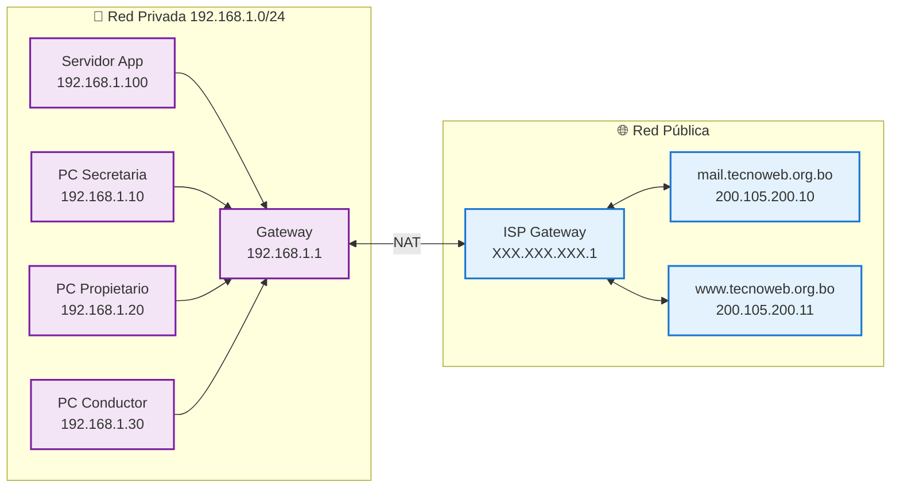
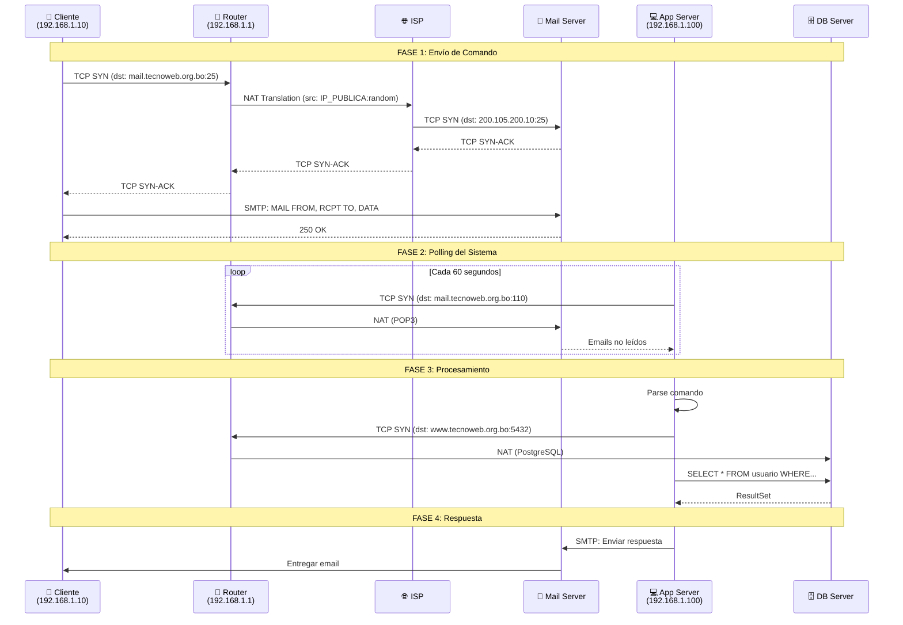
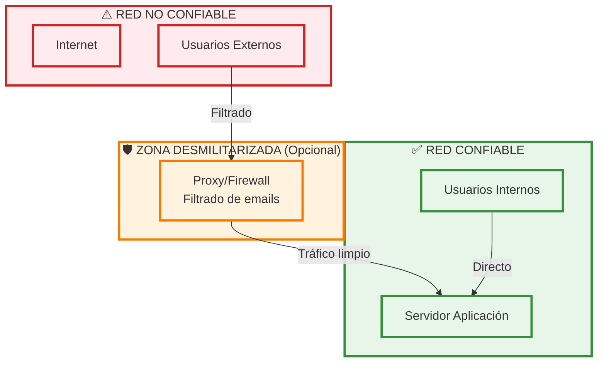
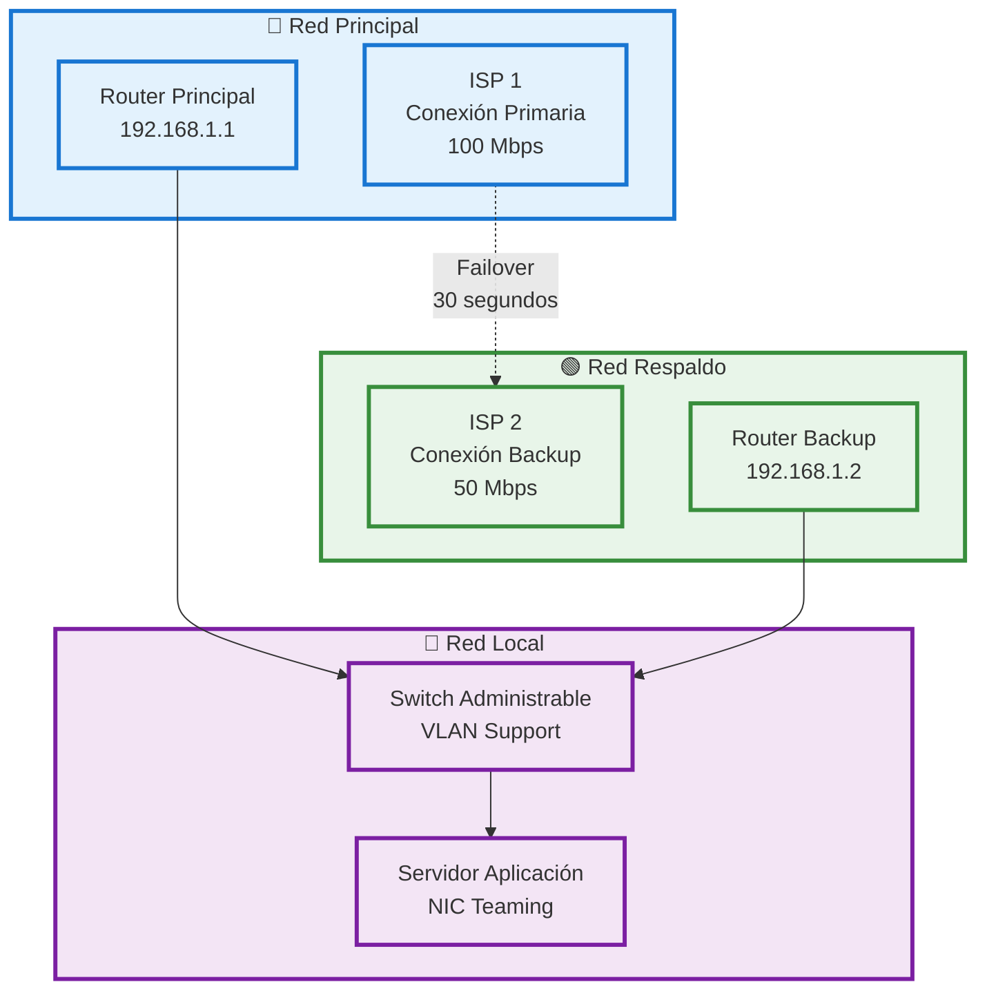
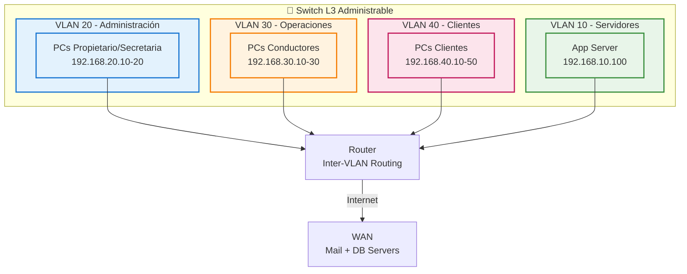

# Diagrama de Arquitectura de Red - Sistema Trans Comarapa

## Resumen Ejecutivo

El sistema utiliza una **arquitectura de red distribuida** basada en protocolos estándar de Internet (SMTP, POP3, PostgreSQL) con comunicación cliente-servidor a través de múltiples redes.

---

## Diagrama de Arquitectura de Red Completo



---

## Topología de Red

### Tipo de Topología
- **Estrella Extendida** (Local) + **Cliente-Servidor** (Internet)
- Red LAN conectada a Internet mediante router
- Servidores remotos en infraestructura cloud

### Segmentos de Red

| Segmento | Tipo | Rango IP | Gateway | Uso |
|----------|------|----------|---------|-----|
| **LAN Local** | Privada | 192.168.1.0/24 | 192.168.1.1 | Red interna de la empresa |
| **Internet** | Pública | - | ISP Gateway | Comunicación con servicios externos |
| **Cloud Tecnoweb** | Pública | 200.105.200.0/24 | - | Infraestructura de servidores |
| **Red Móvil** | Pública | Dinámica | Carrier Gateway | Acceso desde dispositivos móviles |

---

## Diagrama de Direccionamiento IP



---

## Configuración de Red por Dispositivo

### 1. Router/Gateway (192.168.1.1)

**Configuración de Red:**
```
IP Pública: Asignada por ISP (Dinámica)
IP Privada: 192.168.1.1
Máscara de Subred: 255.255.255.0
DHCP Server: Habilitado (192.168.1.10 - 192.168.1.254)
NAT: Habilitado
DNS Primario: 8.8.8.8 (Google)
DNS Secundario: 1.1.1.1 (Cloudflare)
```

**Port Forwarding (Opcional para monitoreo):**
```
Externo:8080 → Interno:192.168.1.100:8080 (Spring Boot)
```

**Firewall Rules:**
```
# Permitir salida SMTP (Puerto 25)
ALLOW OUT TCP 25 to mail.tecnoweb.org.bo

# Permitir salida POP3 (Puerto 110)
ALLOW OUT TCP 110 to mail.tecnoweb.org.bo

# Permitir salida PostgreSQL (Puerto 5432)
ALLOW OUT TCP 5432 to www.tecnoweb.org.bo

# Bloquear todo lo demás (default deny)
DENY ALL
```

---

### 2. Servidor Aplicación (192.168.1.100)

**Configuración de Red:**
```
IP Estática: 192.168.1.100
Máscara de Subred: 255.255.255.0
Gateway: 192.168.1.1
DNS Primario: 8.8.8.8
DNS Secundario: 1.1.1.1
Puerto Aplicación: 8080
```

**Interfaces de Red:**
```
eth0: 192.168.1.100/24
  Speed: 1000 Mb/s (Gigabit)
  Duplex: Full
  MTU: 1500
  Estado: UP
```

**Tabla de Rutas:**
```
Destino          Gateway         Interfaz
0.0.0.0/0        192.168.1.1     eth0     # Default route
192.168.1.0/24   0.0.0.0         eth0     # Red local
```

**Puertos Abiertos:**
```
Puerto 8080 (TCP) → Spring Boot (solo LAN)
```

---

### 3. Estaciones de Trabajo (192.168.1.10-50)

**Configuración de Red (DHCP):**
```
IP: 192.168.1.10 - 192.168.1.50 (Dinámica)
Máscara de Subred: 255.255.255.0
Gateway: 192.168.1.1
DNS: 8.8.8.8, 1.1.1.1
```

**Distribución:**
| Usuario | IP | Hostname | Cliente Email |
|---------|-----|----------|---------------|
| Secretaria | 192.168.1.10 | PC-SECRETARIA | Outlook |
| Propietario | 192.168.1.20 | PC-PROPIETARIO | Gmail Web |
| Conductor 1 | 192.168.1.30 | PC-CONDUCTOR1 | Thunderbird |
| Conductor 2 | 192.168.1.31 | PC-CONDUCTOR2 | Thunderbird |

---

## Protocolos de Red Utilizados

### Capa de Aplicación (L7)

| Protocolo | Puerto | Dirección | Uso | Cifrado |
|-----------|--------|-----------|-----|---------|
| **SMTP** | 25 | Bidireccional | Envío/Recepción emails | ❌ No |
| **POP3** | 110 | Servidor → Cliente | Descarga emails | ❌ No |
| **PostgreSQL** | 5432 | Bidireccional | Consultas BD | ⚠️ Opcional (SSL) |
| **HTTP** | 8080 | Solo LAN | Monitoreo Spring Boot | ❌ No |
| **DNS** | 53 | Cliente → DNS | Resolución nombres | ❌ No |

### Capa de Transporte (L4)

| Protocolo | Características | Uso |
|-----------|-----------------|-----|
| **TCP** | Orientado a conexión, confiable | SMTP, POP3, PostgreSQL, HTTP |
| **UDP** | Sin conexión, rápido | DNS queries |

### Capa de Red (L3)

| Protocolo | Versión | Uso |
|-----------|---------|-----|
| **IP** | IPv4 | Direccionamiento y enrutamiento |
| **ICMP** | ICMPv4 | Ping, traceroute, diagnóstico |

### Capa de Enlace (L2)

| Protocolo | Uso |
|-----------|-----|
| **Ethernet** | Comunicación en LAN (802.3) |
| **ARP** | Resolución IP → MAC |

---

## Flujo de Tráfico de Red

### Request: Cliente → Sistema → Base de Datos



---

## Análisis de Tráfico de Red

### Ancho de Banda Estimado

| Tipo de Tráfico | Tamaño Promedio | Frecuencia | Ancho Banda |
|------------------|-----------------|------------|-------------|
| Email Comando | 2 KB | 10/hora | ~0.05 Kbps |
| Email Respuesta | 5 KB | 10/hora | ~0.11 Kbps |
| Query PostgreSQL | 1 KB | 20/hora | ~0.04 Kbps |
| Response PostgreSQL | 10 KB | 20/hora | ~0.44 Kbps |
| **Total** | - | - | **< 1 Kbps** |

**Conclusión:** El sistema requiere **muy poco ancho de banda** (~1 Kbps en promedio).

### Latencia de Red

| Conexión | Latencia Típica | Latencia Máxima Aceptable |
|----------|-----------------|---------------------------|
| LAN (Cliente → Servidor App) | < 1 ms | 10 ms |
| WAN (Servidor App → Mail) | 20-50 ms | 200 ms |
| WAN (Servidor App → DB) | 20-50 ms | 200 ms |
| **Total Round-Trip** | ~60 ms | 500 ms |

---

## Seguridad de Red

### Perímetro de Seguridad



### Amenazas y Mitigaciones

| Amenaza | Riesgo | Mitigación Actual | Mitigación Recomendada |
|---------|--------|-------------------|------------------------|
| **Man-in-the-Middle** | Alto | ❌ Ninguna | ✅ Usar SMTPS/POP3S (SSL/TLS) |
| **Email Spoofing** | Alto | ❌ Ninguna | ✅ SPF, DKIM, DMARC |
| **SQL Injection** | Medio | ✅ JPA (preparado) | ✅ Validación adicional |
| **DDoS** | Bajo | ❌ Ninguna | ✅ Rate limiting |
| **Acceso no autorizado** | Alto | ❌ Ninguna | ✅ Autenticación de usuarios |
| **Sniffing** | Alto | ❌ Tráfico plano | ✅ VPN o SSL/TLS |

### Configuración de Firewall Recomendada

#### Firewall de Red (Router)

**Reglas Inbound (Entrante):**
```
# Bloquear todo por defecto
DEFAULT POLICY: DENY

# No se requieren puertos entrantes (aplicación es cliente)
```

**Reglas Outbound (Saliente):**
```
# Permitir SMTP saliente
ALLOW TCP 192.168.1.100 → mail.tecnoweb.org.bo:25

# Permitir POP3 saliente
ALLOW TCP 192.168.1.100 → mail.tecnoweb.org.bo:110

# Permitir PostgreSQL saliente
ALLOW TCP 192.168.1.100 → www.tecnoweb.org.bo:5432

# Permitir DNS
ALLOW UDP 192.168.1.0/24 → ANY:53

# Permitir HTTP/HTTPS para actualizaciones
ALLOW TCP 192.168.1.100 → ANY:80,443

# Denegar todo lo demás
DENY ALL
```

#### Firewall de Host (Servidor Aplicación)

**Windows Firewall:**
```powershell
# Bloquear todo entrante excepto LAN
New-NetFirewallRule -DisplayName "Block All Inbound" `
    -Direction Inbound -Action Block

# Permitir Spring Boot solo desde LAN
New-NetFirewallRule -DisplayName "Spring Boot LAN" `
    -Direction Inbound -LocalPort 8080 -Protocol TCP `
    -RemoteAddress 192.168.1.0/24 -Action Allow

# Permitir salida SMTP, POP3, PostgreSQL
New-NetFirewallRule -DisplayName "Email Out" `
    -Direction Outbound -RemotePort 25,110 -Protocol TCP -Action Allow

New-NetFirewallRule -DisplayName "PostgreSQL Out" `
    -Direction Outbound -RemotePort 5432 -Protocol TCP -Action Allow
```

---

## Monitoreo de Red

### Herramientas de Diagnóstico

#### 1. Verificar Conectividad
```powershell
# Ping a servidores remotos
ping mail.tecnoweb.org.bo
ping www.tecnoweb.org.bo

# Traceroute
tracert mail.tecnoweb.org.bo

# Test de puerto SMTP
Test-NetConnection -ComputerName mail.tecnoweb.org.bo -Port 25

# Test de puerto POP3
Test-NetConnection -ComputerName mail.tecnoweb.org.bo -Port 110

# Test de puerto PostgreSQL
Test-NetConnection -ComputerName www.tecnoweb.org.bo -Port 5432
```

#### 2. Monitoreo de Tráfico
```powershell
# Ver conexiones activas
netstat -ano | findstr "25 110 5432 8080"

# Monitoreo en tiempo real
Get-NetTCPConnection | Where-Object {$_.State -eq "Established"}

# Estadísticas de red
Get-NetAdapterStatistics
```

#### 3. Análisis de Paquetes
```bash
# Captura con tcpdump (Linux)
tcpdump -i eth0 port 25 or port 110 or port 5432 -w capture.pcap

# Análisis con Wireshark
wireshark capture.pcap
```

### Métricas de Red a Monitorear

| Métrica | Umbral Normal | Alerta |
|---------|---------------|--------|
| **Latencia a mail server** | < 50 ms | > 200 ms |
| **Latencia a DB server** | < 50 ms | > 200 ms |
| **Packet Loss** | 0% | > 1% |
| **Ancho de banda usado** | < 10 Kbps | > 100 Kbps |
| **Conexiones TCP activas** | 2-5 | > 20 |
| **Errores de red** | 0/min | > 5/min |

---

## Redundancia y Alta Disponibilidad

### Configuración de Red Redundante (Opcional)



### Estrategias de Redundancia

| Componente | Estrategia | Tiempo Recuperación |
|------------|------------|---------------------|
| **Conexión Internet** | Dual ISP con failover | 30 segundos |
| **Router** | Router backup con VRRP | 10 segundos |
| **Switch** | Stacking o LACP | < 1 segundo |
| **NIC Servidor** | NIC Teaming (bonding) | Inmediato |
| **Mail Server** | DNS Failover (MX records) | 5 minutos |
| **DB Server** | PostgreSQL Replica | Manual |

---

## Optimización de Red

### Calidad de Servicio (QoS)

**Priorización de Tráfico:**
| Prioridad | Tipo de Tráfico | DSCP | Acción |
|-----------|-----------------|------|--------|
| **Alta** | PostgreSQL (5432) | EF (46) | Prioridad máxima |
| **Media** | SMTP/POP3 (25/110) | AF21 (18) | Garantizar entrega |
| **Baja** | HTTP/HTTPS (80/443) | BE (0) | Best effort |

### Optimizaciones Recomendadas

1. **TCP Window Scaling** - Aumentar ventana TCP para WAN
   ```powershell
   netsh int tcp set global autotuninglevel=normal
   ```

2. **DNS Caching** - Reducir consultas DNS
   ```powershell
   Set-DnsClientServerAddress -InterfaceAlias "Ethernet" -ServerAddresses ("8.8.8.8","1.1.1.1")
   ```

3. **Connection Pooling** - Reusar conexiones PostgreSQL
   ```properties
   spring.datasource.hikari.maximum-pool-size=10
   spring.datasource.hikari.minimum-idle=5
   spring.datasource.hikari.connection-timeout=30000
   ```

4. **Keep-Alive** - Mantener conexiones vivas
   ```properties
   spring.datasource.hikari.keepaliveTime=300000
   ```

---

## Troubleshooting de Red

### Problemas Comunes

#### 1. No se puede conectar al servidor de email
```powershell
# Diagnóstico
nslookup mail.tecnoweb.org.bo
Test-NetConnection -ComputerName mail.tecnoweb.org.bo -Port 25
Test-NetConnection -ComputerName mail.tecnoweb.org.bo -Port 110

# Posibles causas
# - Firewall bloqueando puertos
# - DNS no resuelve
# - Servidor caído
# - Credenciales incorrectas
```

#### 2. No se puede conectar a la base de datos
```powershell
# Diagnóstico
nslookup www.tecnoweb.org.bo
Test-NetConnection -ComputerName www.tecnoweb.org.bo -Port 5432
telnet www.tecnoweb.org.bo 5432

# Posibles causas
# - Firewall bloqueando puerto 5432
# - PostgreSQL no acepta conexiones remotas
# - Credenciales incorrectas
# - Límite de conexiones alcanzado
```

#### 3. Latencia alta
```powershell
# Diagnóstico
ping -n 100 mail.tecnoweb.org.bo
tracert mail.tecnoweb.org.bo
pathping mail.tecnoweb.org.bo

# Posibles causas
# - Congestión de red
# - ISP con problemas
# - Ruta de red subóptima
# - Servidor sobrecargado
```

#### 4. Pérdida de paquetes
```powershell
# Diagnóstico
ping -t mail.tecnoweb.org.bo
Get-NetAdapterStatistics

# Posibles causas
# - Cable de red dañado
# - Switch o router fallando
# - NIC defectuosa
# - Interferencia inalámbrica
```

---

## Diagrama de Segmentación VLAN (Avanzado)



### Beneficios de VLAN
- ✅ **Segmentación lógica** de red por departamento
- ✅ **Aislamiento de tráfico** entre VLANs
- ✅ **Mejor seguridad** mediante ACLs
- ✅ **Optimización de broadcast domain**
- ✅ **Flexibilidad** en asignación de recursos

---

## Resumen de Configuración de Red

### Checklist de Implementación

- [ ] **Router configurado** con IP estática en LAN
- [ ] **NAT habilitado** para acceso a Internet
- [ ] **DHCP configurado** para estaciones de trabajo
- [ ] **DNS configurado** (8.8.8.8, 1.1.1.1)
- [ ] **Firewall rules** aplicadas (permitir SMTP, POP3, PostgreSQL)
- [ ] **Servidor aplicación** con IP estática (192.168.1.100)
- [ ] **Port forwarding** configurado (opcional para monitoreo)
- [ ] **Tests de conectividad** ejecutados y exitosos
- [ ] **Monitoreo de red** configurado
- [ ] **Backup de configuración** de router guardado

### Documentación de Red Requerida

1. ✅ Diagrama de topología física
2. ✅ Diagrama de topología lógica
3. ✅ Tabla de direccionamiento IP
4. ✅ Configuración de router (backup)
5. ✅ Reglas de firewall documentadas
6. ✅ Credenciales de acceso a equipos
7. ✅ Procedimientos de troubleshooting
8. ✅ Plan de recuperación ante desastres
