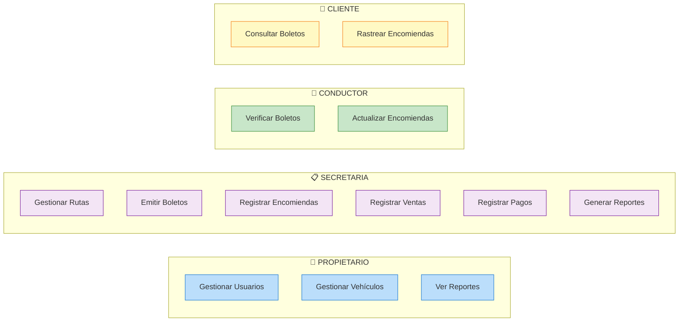
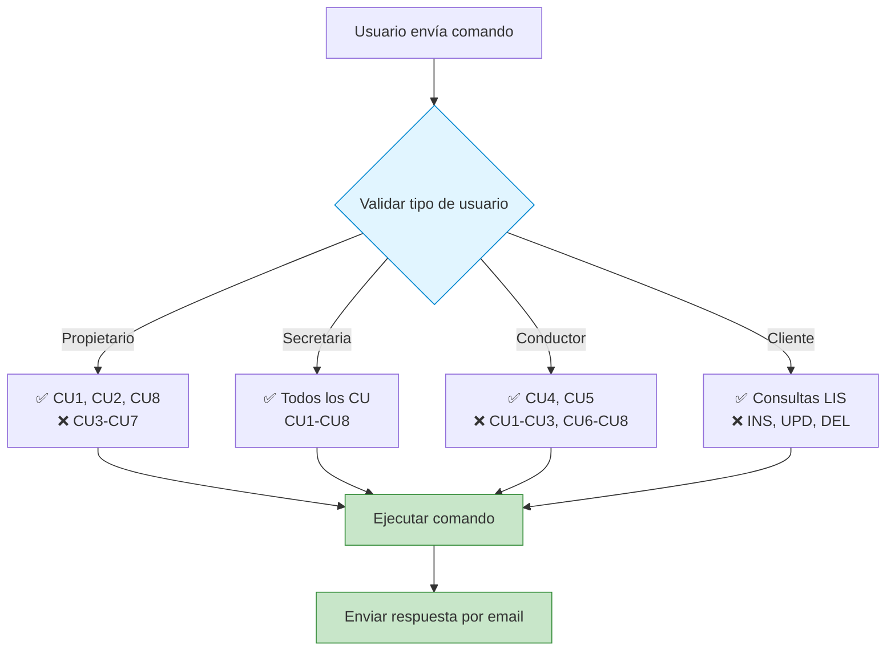
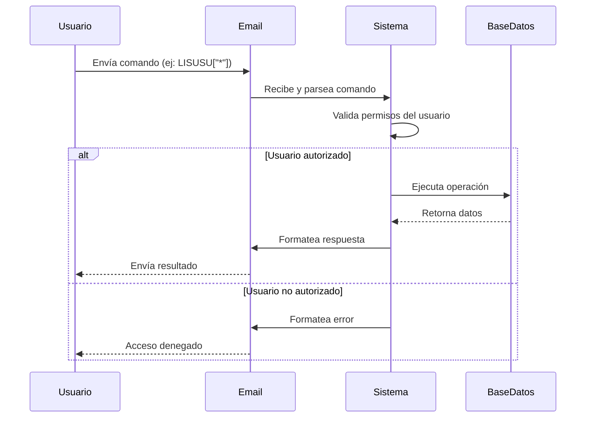

# Diagrama de Casos de Uso - Sistema Trans Comarapa

## Diagrama General de Casos de Uso

```mermaid
graph TB
    subgraph "Actores"
        PROP[👔 Propietario]
        SEC[📋 Secretaria]
        COND[🚐 Conductor]
        CLI[🎫 Cliente/Pasajero]
    end
    
    subgraph "Sistema Trans Comarapa"
        subgraph "CU - Gestión Administrativa"
            CU1[CU1: Gestión de Usuarios<br/>LISUSU, INSUSU, UPDUSU, DELUSU]
            CU2[CU2: Gestión de Vehículos<br/>LISVEH, INSVEH, UPDVEH, DELVEH]
            CU3[CU3: Gestión de Rutas<br/>LISRUT, INSRUT, UPDRUT, DELRUT]
        end
        
        subgraph "CU - Operaciones de Venta"
            CU4[CU4: Gestión de Boletos<br/>LISBOL, INSBOL, UPDBOL, DELBOL]
            CU5[CU5: Gestión de Encomiendas<br/>LISENC, INSENC, UPDENC, DELENC]
            CU6[CU6: Gestión de Ventas<br/>LISVEN, INSVEN]
        end
        
        subgraph "CU - Finanzas y Reportes"
            CU7[CU7: Gestión de Pagos<br/>LISPAG, INSPAG, UPDPAG]
            CU8[CU8: Reportes y Estadísticas<br/>REPREP]
        end
    end
    
    %% Propietario
    PROP --> CU1
    PROP --> CU2
    PROP --> CU8
    
    %% Secretaria
    SEC --> CU3
    SEC --> CU4
    SEC --> CU5
    SEC --> CU6
    SEC --> CU7
    SEC --> CU8
    
    %% Conductor
    COND --> CU4
    COND --> CU5
    
    %% Cliente
    CLI -.-> CU4
    CLI -.-> CU5
    
    classDef actor fill:#fff9c4,stroke:#f57f17,stroke-width:2px
    classDef admin fill:#e1f5ff,stroke:#0288d1,stroke-width:2px
    classDef venta fill:#f3e5f5,stroke:#7b1fa2,stroke-width:2px
    classDef finance fill:#e8f5e9,stroke:#388e3c,stroke-width:2px
    
    class PROP,SEC,COND,CLI actor
    class CU1,CU2,CU3 admin
    class CU4,CU5,CU6 venta
    class CU7,CU8 finance
```



## Diagrama por Actor



## Comandos por Caso de Uso

### 📊 Resumen de Comandos Disponibles

| Caso de Uso | Comandos Implementados | Actor Principal |
|-------------|------------------------|-----------------|
| **CU1: Usuarios** | `LISUSU`, `INSUSU`, `UPDUSU`, `DELUSU` | Propietario |
| **CU2: Vehículos** | `LISVEH`, `INSVEH`, `UPDVEH`, `DELVEH` | Propietario |
| **CU3: Rutas** | `LISRUT`, `INSRUT`, `UPDRUT`, `DELRUT` | Secretaria |
| **CU4: Boletos** | `LISBOL`, `INSBOL`, `UPDBOL`, `DELBOL` | Secretaria, Conductor |
| **CU5: Encomiendas** | `LISENC`, `INSENC`, `UPDENC`, `DELENC` | Secretaria, Conductor |
| **CU6: Ventas** | `LISVEN`, `INSVEN` | Secretaria |
| **CU7: Pagos** | `LISPAG`, `INSPAG`, `UPDPAG` | Secretaria |
| **CU8: Reportes** | `REPREP[tipo]` | Propietario, Secretaria |

## Ejemplos de Uso por Actor

### 👔 Propietario

```
📧 Para: grupo04sa@tecnoweb.org.bo

Asunto: LISUSU["*"]           → Ver todos los usuarios
Asunto: LISVEH["*"]           → Ver todos los vehículos
Asunto: REPREP["VENTAS_DIA","2025-11-13"] → Reporte de ventas
```

### 📋 Secretaria

```
📧 Para: grupo04sa@tecnoweb.org.bo

Asunto: LISRUT["*"]           → Ver todas las rutas
Asunto: INSBOL[...]           → Emitir boleto
Asunto: INSENC[...]           → Registrar encomienda
Asunto: INSVEN[...]           → Registrar venta
Asunto: INSPAG[...]           → Registrar pago
Asunto: REPREP["PAGOS_PENDIENTES","*"] → Ver pagos pendientes
```

### 🚐 Conductor

```
📧 Para: grupo04sa@tecnoweb.org.bo

Asunto: LISBOL["2025-11-13"]  → Ver boletos del día
Asunto: UPDENC[...]           → Actualizar estado de encomienda
```

### 🎫 Cliente/Pasajero

```
📧 Para: grupo04sa@tecnoweb.org.bo

Asunto: LISBOL["BOL-001"]     → Consultar mi boleto
Asunto: LISENC["ENC-001"]     → Rastrear mi encomienda
```

## 🎯 Permisos por Tipo de Usuario



## 📝 Flujo Completo de un Caso de Uso


