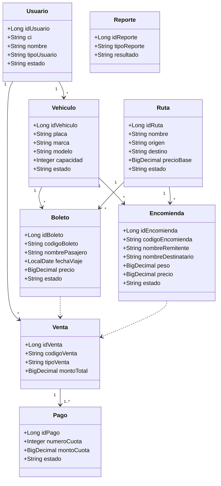
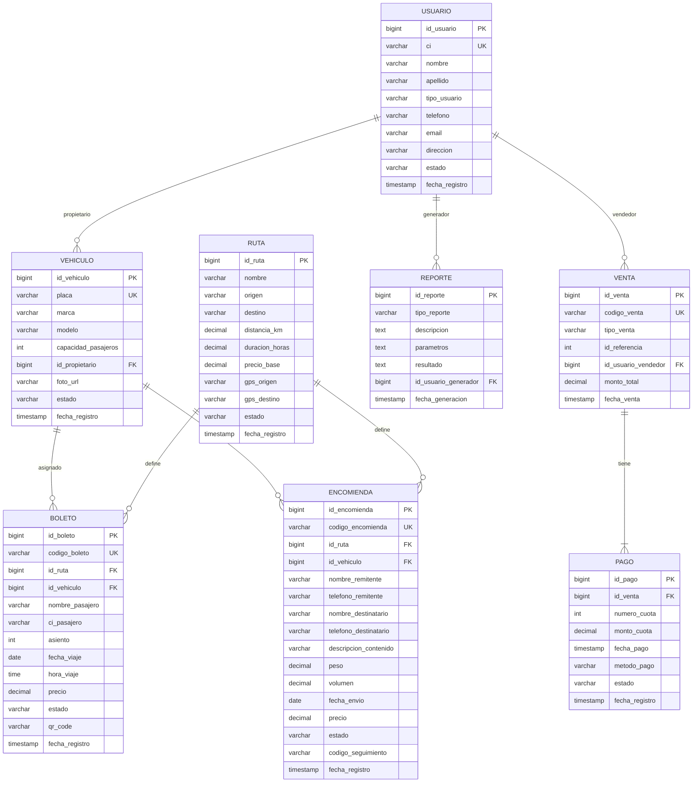

# Diagrama de Clases - Sistema Trans Comarapa

## Resumen Ejecutivo

El sistema está diseñado con **8 entidades principales** que representan el dominio del negocio, siguiendo el patrón **JPA/Hibernate** para persistencia y **Service Layer** para lógica de negocio.

```
Total de Clases de Dominio: 8
Total de Servicios: 11
Total de Repositorios: 8
Total de DTOs: 2
Patrón: Domain Model + Service Layer + Repository
```

---

## Diagrama de Clases Completo

```mermaid
classDiagram

    
    class Usuario {
        -Long idUsuario
        -String ci
        -String nombre
        -String apellido
        -String tipoUsuario
        -String telefono
        -String email
        -String direccion
        -String estado
        -LocalDateTime fechaRegistro
        +Usuario()
        +getNombreCompleto() String
        +isActivo() boolean
        +getters()
        +setters()
    }
    
    class Vehiculo {
        -Long idVehiculo
        -String placa
        -String marca
        -String modelo
        -Integer capacidadPasajeros
        -Usuario propietario
        -String fotoUrl
        -String estado
        -LocalDateTime fechaRegistro
        +Vehiculo()
        +getDescripcion() String
        +isDisponible() boolean
        +getters()
        +setters()
    }
    
    class Ruta {
        -Long idRuta
        -String nombre
        -String origen
        -String destino
        -BigDecimal distanciaKm
        -BigDecimal duracionHoras
        -BigDecimal precioBase
        -String gpsOrigen
        -String gpsDestino
        -String estado
        -LocalDateTime fechaRegistro
        +Ruta()
        +getDescripcionCompleta() String
        +isActiva() boolean
        +getters()
        +setters()
    }
    
    class Boleto {
        -Long idBoleto
        -String codigoBoleto
        -Ruta ruta
        -Vehiculo vehiculo
        -String nombrePasajero
        -String ciPasajero
        -Integer asiento
        -LocalDate fechaViaje
        -LocalTime horaViaje
        -BigDecimal precio
        -String estado
        -String qrCode
        -LocalDateTime fechaRegistro
        +Boleto()
        -generarCodigoBoleto() String
        +isUsado() boolean
        +getters()
        +setters()
    }
    
    class Encomienda {
        -Long idEncomienda
        -String codigoEncomienda
        -Ruta ruta
        -Vehiculo vehiculo
        -String nombreRemitente
        -String telefonoRemitente
        -String nombreDestinatario
        -String telefonoDestinatario
        -String descripcionContenido
        -BigDecimal peso
        -BigDecimal volumen
        -LocalDate fechaEnvio
        -BigDecimal precio
        -String estado
        -String codigoSeguimiento
        -LocalDateTime fechaRegistro
        +Encomienda()
        -generarCodigoEncomienda() String
        +isEntregada() boolean
        +getters()
        +setters()
    }
    
    class Venta {
        -Long idVenta
        -String codigoVenta
        -String tipoVenta
        -Integer idReferencia
        -Usuario vendedor
        -BigDecimal montoTotal
        -LocalDateTime fechaVenta
        +Venta()
        -generarCodigoVenta() String
        +getters()
        +setters()
    }
    
    class Pago {
        -Long idPago
        -Venta venta
        -Integer numeroCuota
        -BigDecimal montoCuota
        -LocalDateTime fechaPago
        -String metodoPago
        -String estado
        -LocalDateTime fechaRegistro
        +Pago()
        +isPagado() boolean
        +isPendiente() boolean
        +getters()
        +setters()
    }
    
    class Reporte {
        -Long idReporte
        -String tipoReporte
        -String descripcion
        -String parametros
        -String resultado
        -Usuario usuarioGenerador
        -LocalDateTime fechaGeneracion
        +Reporte()
        +Reporte(String, String)
        +getters()
        +setters()
    }
    
    %% ========== RELACIONES ENTRE ENTIDADES ==========
    
    Usuario "1" --> "0..*" Vehiculo : propietario
    Usuario "1" --> "0..*" Venta : vendedor
    Usuario "1" --> "0..*" Reporte : generador
    
    Vehiculo "1" --> "0..*" Boleto : asignado
    Vehiculo "1" --> "0..*" Encomienda : asignado
    
    Ruta "1" --> "0..*" Boleto : define
    Ruta "1" --> "0..*" Encomienda : define
    
    Venta "1" --> "1..*" Pago : pagos
    
    Boleto ..> Venta : referencia
    Encomienda ..> Venta : referencia
    
    %% ========== SERVICIOS DE NEGOCIO ==========
    
    class UsuarioService {
        -UsuarioRepository repository
        +listarUsuarios() List~Usuario~
        +obtenerUsuario(Long) Usuario
        +crearUsuario(Usuario) Usuario
        +actualizarUsuario(Long, Usuario) Usuario
        +eliminarUsuario(Long) void
        +buscarPorCi(String) Usuario
        +buscarPorTipo(String) List~Usuario~
    }
    
    class VehiculoService {
        -VehiculoRepository repository
        -UsuarioRepository usuarioRepository
        +listarVehiculos() List~Vehiculo~
        +obtenerVehiculo(Long) Vehiculo
        +crearVehiculo(Vehiculo) Vehiculo
        +actualizarVehiculo(Long, Vehiculo) Vehiculo
        +eliminarVehiculo(Long) void
        +buscarPorPlaca(String) Vehiculo
        +buscarPorEstado(String) List~Vehiculo~
    }
    
    class RutaService {
        -RutaRepository repository
        +listarRutas() List~Ruta~
        +obtenerRuta(Long) Ruta
        +crearRuta(Ruta) Ruta
        +actualizarRuta(Long, Ruta) Ruta
        +eliminarRuta(Long) void
        +buscarPorOrigen(String) List~Ruta~
        +buscarPorDestino(String) List~Ruta~
    }
    
    class BoletoService {
        -BoletoRepository repository
        -RutaRepository rutaRepository
        -VehiculoRepository vehiculoRepository
        +listarBoletos() List~Boleto~
        +obtenerBoleto(Long) Boleto
        +crearBoleto(Boleto) Boleto
        +actualizarBoleto(Long, Boleto) Boleto
        +eliminarBoleto(Long) void
        +buscarPorCodigo(String) Boleto
        -generarQR(String) String
    }
    
    class EncomiendaService {
        -EncomiendaRepository repository
        -RutaRepository rutaRepository
        -VehiculoRepository vehiculoRepository
        +listarEncomiendas() List~Encomienda~
        +obtenerEncomienda(Long) Encomienda
        +crearEncomienda(Encomienda) Encomienda
        +actualizarEncomienda(Long, Encomienda) Encomienda
        +eliminarEncomienda(Long) void
        +buscarPorCodigo(String) Encomienda
        +buscarPorEstado(String) List~Encomienda~
    }
    
    class VentaService {
        -VentaRepository repository
        -UsuarioRepository usuarioRepository
        +listarVentas() List~Venta~
        +crearVenta(Venta) Venta
        +buscarPorCodigo(String) Venta
        +buscarPorTipo(String) List~Venta~
    }
    
    class PagoService {
        -PagoRepository repository
        -VentaRepository ventaRepository
        +listarPagos() List~Pago~
        +crearPago(Pago) Pago
        +actualizarPago(Long, Pago) Pago
        +buscarPorVenta(Long) List~Pago~
        +buscarPorEstado(String) List~Pago~
    }
    
    class ReporteService {
        -ReporteRepository repository
        -BoletoRepository boletoRepository
        -EncomiendaRepository encomiendaRepository
        -VentaRepository ventaRepository
        -PagoRepository pagoRepository
        -RutaRepository rutaRepository
        +generarReporte(String) Reporte
        +listarReportes() List~Reporte~
        -generarReporteVentasDia() String
        -generarReporteBoletos() String
        -generarReporteEncomiendas() String
        -generarReportePagos() String
        -generarReporteRutas() String
    }
    
    %% ========== REPOSITORIOS ==========
    
    class UsuarioRepository {
        <<interface>>
        +findByCi(String) Optional~Usuario~
        +findByTipoUsuario(String) List~Usuario~
    }
    
    class VehiculoRepository {
        <<interface>>
        +findByPlaca(String) Optional~Vehiculo~
        +findByEstado(String) List~Vehiculo~
    }
    
    class RutaRepository {
        <<interface>>
        +findByOrigen(String) List~Ruta~
        +findByDestino(String) List~Ruta~
    }
    
    class BoletoRepository {
        <<interface>>
        +findByCodigoBoleto(String) Optional~Boleto~
        +findByFechaViaje(LocalDate) List~Boleto~
    }
    
    class EncomiendaRepository {
        <<interface>>
        +findByCodigoEncomienda(String) Optional~Encomienda~
        +findByEstado(String) List~Encomienda~
    }
    
    class VentaRepository {
        <<interface>>
        +findByCodigoVenta(String) Optional~Venta~
        +findByTipoVenta(String) List~Venta~
    }
    
    class PagoRepository {
        <<interface>>
        +findByEstado(String) List~Pago~
        +findByVenta(Venta) List~Pago~
    }
    
    class ReporteRepository {
        <<interface>>
        +findByTipoReporte(String) List~Reporte~
    }
    
    %% ========== DTOs Y UTILIDADES ==========
    
    class CommandRequest {
        -String operation
        -String entity
        -Map~String,String~ parameters
        -String sender
        +CommandRequest()
        +getters()
        +setters()
    }
    
    class CommandResponse {
        -String status
        -String message
        -Object data
        -String fullCommand
        +CommandResponse()
        +success(String, Object) CommandResponse
        +error(String) CommandResponse
        +getters()
        +setters()
    }
    
    class EmailScheduler {
        -EmailService emailService
        -CommandParserService parserService
        -CommandExecutorService executorService
        -ResponseFormatter formatter
        +processEmails() void
    }
    
    class EmailService {
        +receiveEmails() List~Message~
        +sendEmail(String, String, String) void
        +markAsRead(Message) void
    }
    
    class CommandParserService {
        +parse(String) CommandRequest
        -validateCommand(String) boolean
        -extractParameters(String) Map
    }
    
    class CommandExecutorService {
        -UsuarioService usuarioService
        -VehiculoService vehiculoService
        -RutaService rutaService
        -BoletoService boletoService
        -EncomiendaService encomiendaService
        -VentaService ventaService
        -PagoService pagoService
        -ReporteService reporteService
        +execute(CommandRequest) CommandResponse
    }
    
    class ResponseFormatter {
        +formatResponse(CommandResponse) String
        +formatList(List) String
        +formatEntity(Object) String
    }
    
    %% ========== RELACIONES SERVICIOS-REPOSITORIOS ==========
    
    UsuarioService --> UsuarioRepository : usa
    VehiculoService --> VehiculoRepository : usa
    VehiculoService --> UsuarioRepository : usa
    RutaService --> RutaRepository : usa
    BoletoService --> BoletoRepository : usa
    BoletoService --> RutaRepository : usa
    BoletoService --> VehiculoRepository : usa
    EncomiendaService --> EncomiendaRepository : usa
    EncomiendaService --> RutaRepository : usa
    EncomiendaService --> VehiculoRepository : usa
    VentaService --> VentaRepository : usa
    VentaService --> UsuarioRepository : usa
    PagoService --> PagoRepository : usa
    PagoService --> VentaRepository : usa
    ReporteService --> ReporteRepository : usa
    ReporteService --> BoletoRepository : usa
    ReporteService --> EncomiendaRepository : usa
    ReporteService --> VentaRepository : usa
    ReporteService --> PagoRepository : usa
    ReporteService --> RutaRepository : usa
    
    %% ========== RELACIONES SERVICIOS-ENTIDADES ==========
    
    UsuarioService ..> Usuario : gestiona
    VehiculoService ..> Vehiculo : gestiona
    RutaService ..> Ruta : gestiona
    BoletoService ..> Boleto : gestiona
    EncomiendaService ..> Encomienda : gestiona
    VentaService ..> Venta : gestiona
    PagoService ..> Pago : gestiona
    ReporteService ..> Reporte : gestiona
    
    %% ========== RELACIONES REPOSITORIOS-ENTIDADES ==========
    
    UsuarioRepository ..> Usuario : persiste
    VehiculoRepository ..> Vehiculo : persiste
    RutaRepository ..> Ruta : persiste
    BoletoRepository ..> Boleto : persiste
    EncomiendaRepository ..> Encomienda : persiste
    VentaRepository ..> Venta : persiste
    PagoRepository ..> Pago : persiste
    ReporteRepository ..> Reporte : persiste
    
    %% ========== RELACIONES CAPA PRESENTACIÓN ==========
    
    EmailScheduler --> EmailService : usa
    EmailScheduler --> CommandParserService : usa
    EmailScheduler --> CommandExecutorService : usa
    EmailScheduler --> ResponseFormatter : usa
    
    CommandParserService ..> CommandRequest : crea
    CommandExecutorService ..> CommandResponse : crea
    CommandExecutorService --> UsuarioService : delega
    CommandExecutorService --> VehiculoService : delega
    CommandExecutorService --> RutaService : delega
    CommandExecutorService --> BoletoService : delega
    CommandExecutorService --> EncomiendaService : delega
    CommandExecutorService --> VentaService : delega
    CommandExecutorService --> PagoService : delega
    CommandExecutorService --> ReporteService : delega
    
    ResponseFormatter ..> CommandResponse : formatea
```



---

## Detalle de Clases por Categoría

### 1. Entidades del Dominio (Model)

#### Usuario
**Responsabilidad:** Gestionar información de usuarios del sistema (Propietario, Secretaria, Conductor)

| Atributo | Tipo | Descripción | Validación |
|----------|------|-------------|------------|
| idUsuario | Long | Identificador único | PK, Auto-increment |
| ci | String | Cédula de identidad | Único, @NotBlank, max 20 |
| nombre | String | Nombre del usuario | @NotBlank, max 100 |
| apellido | String | Apellido del usuario | @NotBlank, max 100 |
| tipoUsuario | String | Tipo: PROPIETARIO/SECRETARIA/CONDUCTOR | @NotBlank |
| telefono | String | Teléfono de contacto | max 20 |
| email | String | Email de contacto | @Email, max 100 |
| direccion | String | Dirección física | max 255 |
| estado | String | ACTIVO/INACTIVO | default ACTIVO |
| fechaRegistro | LocalDateTime | Fecha de creación | Auto |

**Relaciones:**
- `1:N` con `Vehiculo` (como propietario)
- `1:N` con `Venta` (como vendedor)

---

#### Vehiculo
**Responsabilidad:** Gestionar información de vehículos de transporte

| Atributo | Tipo | Descripción | Validación |
|----------|------|-------------|------------|
| idVehiculo | Long | Identificador único | PK, Auto-increment |
| placa | String | Placa del vehículo | Único, @NotBlank, max 20 |
| marca | String | Marca del vehículo | @NotBlank, max 50 |
| modelo | String | Modelo del vehículo | @NotBlank, max 50 |
| capacidadPasajeros | Integer | Número de asientos | @Min(1) |
| propietario | Usuario | Propietario del vehículo | ManyToOne |
| fotoUrl | String | URL de la foto | max 255 |
| estado | String | DISPONIBLE/EN_RUTA/MANTENIMIENTO | default DISPONIBLE |
| fechaRegistro | LocalDateTime | Fecha de creación | Auto |

**Relaciones:**
- `N:1` con `Usuario` (propietario)
- `1:N` con `Boleto` (asignado)
- `1:N` con `Encomienda` (asignado)

---

#### Ruta
**Responsabilidad:** Gestionar rutas de viaje disponibles

| Atributo | Tipo | Descripción | Validación |
|----------|------|-------------|------------|
| idRuta | Long | Identificador único | PK, Auto-increment |
| nombre | String | Nombre descriptivo de la ruta | @NotBlank, max 100 |
| origen | String | Ciudad/lugar de origen | @NotBlank, max 100 |
| destino | String | Ciudad/lugar de destino | @NotBlank, max 100 |
| distanciaKm | BigDecimal | Distancia en kilómetros | max 10,2 |
| duracionHoras | BigDecimal | Duración estimada | max 5,2 |
| precioBase | BigDecimal | Precio base del pasaje | @DecimalMin(0.01), max 10,2 |
| gpsOrigen | String | Coordenadas GPS origen | max 100 |
| gpsDestino | String | Coordenadas GPS destino | max 100 |
| estado | String | ACTIVO/INACTIVO | default ACTIVO |
| fechaRegistro | LocalDateTime | Fecha de creación | Auto |

**Relaciones:**
- `1:N` con `Boleto` (define)
- `1:N` con `Encomienda` (define)

---

#### Boleto
**Responsabilidad:** Gestionar boletos de pasajeros

| Atributo | Tipo | Descripción | Validación |
|----------|------|-------------|------------|
| idBoleto | Long | Identificador único | PK, Auto-increment |
| codigoBoleto | String | Código único del boleto | Único, @NotBlank, max 50 |
| ruta | Ruta | Ruta del viaje | ManyToOne |
| vehiculo | Vehiculo | Vehículo asignado | ManyToOne |
| nombrePasajero | String | Nombre completo del pasajero | @NotBlank, max 200 |
| ciPasajero | String | CI del pasajero | @NotBlank, max 20 |
| asiento | Integer | Número de asiento | @Min(1) |
| fechaViaje | LocalDate | Fecha del viaje | @NotNull |
| horaViaje | LocalTime | Hora del viaje | @NotNull |
| precio | BigDecimal | Precio del boleto | @DecimalMin(0.01) |
| estado | String | VENDIDO/USADO/CANCELADO | default VENDIDO |
| qrCode | String | Código QR | max 500 |
| fechaRegistro | LocalDateTime | Fecha de creación | Auto |

**Relaciones:**
- `N:1` con `Ruta` (viaja por)
- `N:1` con `Vehiculo` (asignado a)
- Referencia indirecta con `Venta`

---

#### Encomienda
**Responsabilidad:** Gestionar envío de encomiendas

| Atributo | Tipo | Descripción | Validación |
|----------|------|-------------|------------|
| idEncomienda | Long | Identificador único | PK, Auto-increment |
| codigoEncomienda | String | Código único de encomienda | Único, @NotBlank, max 50 |
| ruta | Ruta | Ruta del envío | ManyToOne |
| vehiculo | Vehiculo | Vehículo asignado | ManyToOne |
| nombreRemitente | String | Nombre del que envía | @NotBlank, max 200 |
| telefonoRemitente | String | Teléfono remitente | max 20 |
| nombreDestinatario | String | Nombre del que recibe | @NotBlank, max 200 |
| telefonoDestinatario | String | Teléfono destinatario | max 20 |
| descripcionContenido | String | Descripción del contenido | max 500 |
| peso | BigDecimal | Peso en kg | @DecimalMin(0.01) |
| volumen | BigDecimal | Volumen en m³ | max 10,2 |
| fechaEnvio | LocalDate | Fecha de envío | @NotNull |
| precio | BigDecimal | Precio del servicio | @DecimalMin(0.01) |
| estado | String | REGISTRADA/EN_TRANSITO/ENTREGADA/CANCELADA | default REGISTRADA |
| codigoSeguimiento | String | Código de tracking | max 100 |
| fechaRegistro | LocalDateTime | Fecha de creación | Auto |

**Relaciones:**
- `N:1` con `Ruta` (enviada por)
- `N:1` con `Vehiculo` (transportada en)
- Referencia indirecta con `Venta`

---

#### Venta
**Responsabilidad:** Gestionar ventas de boletos y encomiendas

| Atributo | Tipo | Descripción | Validación |
|----------|------|-------------|------------|
| idVenta | Long | Identificador único | PK, Auto-increment |
| codigoVenta | String | Código único de venta | Único, @NotBlank, max 50 |
| tipoVenta | String | BOLETO/ENCOMIENDA | @NotBlank |
| idReferencia | Integer | ID del boleto o encomienda | @Min(1) |
| vendedor | Usuario | Usuario que realizó la venta | ManyToOne |
| montoTotal | BigDecimal | Monto total de la venta | @DecimalMin(0.01) |
| fechaVenta | LocalDateTime | Fecha de la venta | Auto |

**Relaciones:**
- `N:1` con `Usuario` (vendedor)
- `1:N` con `Pago` (cuotas)
- Referencia indirecta a `Boleto` o `Encomienda`

---

#### Pago
**Responsabilidad:** Gestionar pagos en cuotas

| Atributo | Tipo | Descripción | Validación |
|----------|------|-------------|------------|
| idPago | Long | Identificador único | PK, Auto-increment |
| venta | Venta | Venta asociada | ManyToOne |
| numeroCuota | Integer | Número de cuota (1 o 2) | @Min(1), @Max(2) |
| montoCuota | BigDecimal | Monto de la cuota | @DecimalMin(0.01) |
| fechaPago | LocalDateTime | Fecha de pago | Nullable |
| metodoPago | String | EFECTIVO/TRANSFERENCIA/TARJETA | max 50 |
| estado | String | PENDIENTE/PAGADO/VENCIDO | default PENDIENTE |
| fechaRegistro | LocalDateTime | Fecha de creación | Auto |

**Relaciones:**
- `N:1` con `Venta` (pertenece a)

---

#### Reporte
**Responsabilidad:** Almacenar reportes generados

| Atributo | Tipo | Descripción | Validación |
|----------|------|-------------|------------|
| idReporte | Long | Identificador único | PK, Auto-increment |
| tipoReporte | String | Tipo de reporte | @NotBlank, max 50 |
| descripcion | String | Descripción del reporte | TEXT |
| parametros | String | Parámetros JSON | TEXT |
| resultado | String | Resultado JSON | TEXT |
| usuarioGenerador | Usuario | Usuario que generó el reporte | ManyToOne |
| fechaGeneracion | LocalDateTime | Fecha de generación | Auto |

**Relaciones:**
- `N:1` con `Usuario` (generador)

---

### 2. Servicios de Negocio (Service Layer)

| Servicio | Responsabilidad | Métodos Principales |
|----------|-----------------|---------------------|
| **UsuarioService** | Gestión de usuarios (CU1) | listar, crear, actualizar, eliminar, buscarPorCi |
| **VehiculoService** | Gestión de vehículos (CU2) | listar, crear, actualizar, eliminar, buscarPorPlaca |
| **RutaService** | Gestión de rutas (CU3) | listar, crear, actualizar, eliminar, buscarPorOrigen |
| **BoletoService** | Gestión de boletos (CU4) | listar, crear, actualizar, eliminar, generarQR |
| **EncomiendaService** | Gestión de encomiendas (CU5) | listar, crear, actualizar, eliminar, buscarPorCodigo |
| **VentaService** | Gestión de ventas (CU6) | listar, crear, buscarPorTipo |
| **PagoService** | Gestión de pagos (CU7) | listar, crear, actualizar, buscarPorEstado |
| **ReporteService** | Generación de reportes (CU8) | generarReporte (5 tipos) |
| **EmailService** | Gestión de correos | receiveEmails, sendEmail, markAsRead |
| **CommandParserService** | Parseo de comandos | parse, validateCommand |
| **CommandExecutorService** | Ejecución de comandos | execute (delega a servicios CU) |

---

### 3. Repositorios (Data Access Layer)

Todos los repositorios extienden `JpaRepository<T, Long>` y proporcionan:

**Métodos heredados:**
- `findAll()`, `findById()`, `save()`, `delete()`, `count()`, etc.

**Métodos custom por repositorio:**

| Repository | Métodos Custom |
|------------|----------------|
| **UsuarioRepository** | `findByCi(String)`, `findByTipoUsuario(String)` |
| **VehiculoRepository** | `findByPlaca(String)`, `findByEstado(String)` |
| **RutaRepository** | `findByOrigen(String)`, `findByDestino(String)` |
| **BoletoRepository** | `findByCodigoBoleto(String)`, `findByFechaViaje(LocalDate)` |
| **EncomiendaRepository** | `findByCodigoEncomienda(String)`, `findByEstado(String)` |
| **VentaRepository** | `findByCodigoVenta(String)`, `findByTipoVenta(String)` |
| **PagoRepository** | `findByEstado(String)`, `findByVenta(Venta)` |
| **ReporteRepository** | `findByTipoReporte(String)` |

---

### 4. DTOs y Utilidades

#### CommandRequest
**Propósito:** Encapsular comando parseado del email

| Atributo | Tipo | Descripción |
|----------|------|-------------|
| operation | String | Operación (LIS, INS, UPD, DEL, REP) |
| entity | String | Entidad (USU, VEH, RUT, BOL, ENC, VEN, PAG, REP) |
| parameters | Map<String,String> | Parámetros del comando |
| sender | String | Email del remitente |

#### CommandResponse
**Propósito:** Encapsular respuesta de ejecución

| Atributo | Tipo | Descripción |
|----------|------|-------------|
| status | String | SUCCESS / ERROR |
| message | String | Mensaje descriptivo |
| data | Object | Datos de respuesta |
| fullCommand | String | Comando ejecutado |

---

## Diagrama de Clases Simplificado (Solo Entidades)



---

## Patrones de Diseño Aplicados

| Patrón | Ubicación | Beneficio |
|--------|-----------|-----------|
| **Repository Pattern** | Interfaces Repository | Abstracción del acceso a datos |
| **Service Layer** | Clases Service | Encapsulación de lógica de negocio |
| **DTO (Data Transfer Object)** | CommandRequest/Response | Transferencia entre capas |
| **Active Record (JPA)** | Entidades @Entity | Persistencia automática |
| **Dependency Injection** | @Autowired en servicios | Desacoplamiento |
| **Builder Pattern** | CommandResponse.success() | Construcción fluida |
| **Command Pattern** | CommandRequest/Executor | Encapsular operaciones |
| **Factory Method** | generarCodigoBoleto() | Creación de objetos |
| **Template Method** | Métodos abstractos en servicios | Reutilización de código |

---

## Convenciones y Estándares

### Nomenclatura
- **Entidades:** PascalCase, singular (Usuario, Vehiculo)
- **Atributos:** camelCase (nombrePasajero, fechaViaje)
- **Métodos:** camelCase, verbos (listar, crear, buscarPorCi)
- **Constantes:** UPPER_SNAKE_CASE (MAX_CUOTAS, ESTADO_ACTIVO)

### Validaciones
- **@NotBlank** - Campos de texto obligatorios
- **@Email** - Validación de formato email
- **@Min/@Max** - Rangos numéricos
- **@DecimalMin** - Valores monetarios positivos
- **@Size** - Longitud de cadenas

### Estados Comunes
| Entidad | Estados |
|---------|---------|
| Usuario | ACTIVO, INACTIVO |
| Vehiculo | DISPONIBLE, EN_RUTA, MANTENIMIENTO |
| Ruta | ACTIVO, INACTIVO |
| Boleto | VENDIDO, USADO, CANCELADO |
| Encomienda | REGISTRADA, EN_TRANSITO, ENTREGADA, CANCELADA |
| Pago | PENDIENTE, PAGADO, VENCIDO |

---

## Métricas del Modelo de Clases

| Métrica | Valor |
|---------|-------|
| **Total de Entidades** | 8 |
| **Total de Atributos** | ~80 |
| **Total de Relaciones** | 10 |
| **Total de Servicios** | 11 |
| **Total de Repositorios** | 8 |
| **Profundidad de Herencia** | 1 (JpaRepository) |
| **Acoplamiento Promedio** | Bajo (servicios → repositorios → entidades) |
| **Cohesión** | Alta (responsabilidad única por clase) |

---

## Matriz de Dependencias

| Desde ↓ / Hacia → | Usuario | Vehiculo | Ruta | Boleto | Encomienda | Venta | Pago |
|-------------------|---------|----------|------|--------|------------|-------|------|
| **Usuario** | - | ✅ | - | - | - | ✅ | - |
| **Vehiculo** | - | - | - | ✅ | ✅ | - | - |
| **Ruta** | - | - | - | ✅ | ✅ | - | - |
| **Boleto** | - | ✅ | ✅ | - | - | (ref) | - |
| **Encomienda** | - | ✅ | ✅ | - | - | (ref) | - |
| **Venta** | ✅ | - | - | (ref) | (ref) | - | ✅ |
| **Pago** | - | - | - | - | - | ✅ | - |

**Leyenda:**
- ✅ Relación directa (FK en BD)
- (ref) Referencia indirecta (idReferencia)

---

## Recomendaciones

### ✅ Buenas Prácticas Implementadas
1. ✅ Separación de responsabilidades (SRP)
2. ✅ Uso de interfaces para abstracción
3. ✅ Validaciones en modelo (@Valid)
4. ✅ Auditoría con timestamps
5. ✅ Estados bien definidos
6. ✅ Relaciones bidireccionales controladas

### ⚠️ Mejoras Sugeridas
1. 📋 Agregar clase `Auditoria` para tracking de cambios
2. 🔐 Agregar clase `Permiso` para control de acceso
3. 📊 Agregar clase `Log` para auditoría de comandos
4. 💰 Agregar clase `Descuento` para promociones
5. 📅 Agregar clase `Horario` para gestión de salidas
6. 👤 Agregar clase `Cliente` separada de Usuario
7. 🎫 Considerar herencia para `Boleto` y `Encomienda` (clase padre `Producto`)

---

## Diagrama Entidad-Relación (Base de Datos)



---

## Casos de Uso por Entidad

| Entidad | CU Principal | Operaciones CRUD | Casos de Uso Secundarios |
|---------|--------------|------------------|--------------------------|
| **Usuario** | CU1 | LIS, INS, UPD, DEL | Autenticación, Ventas |
| **Vehiculo** | CU2 | LIS, INS, UPD, DEL | Asignación a viajes |
| **Ruta** | CU3 | LIS, INS, UPD, DEL | Cálculo de precios |
| **Boleto** | CU4 | LIS, INS, UPD, DEL | Generación QR, Check-in |
| **Encomienda** | CU5 | LIS, INS, UPD, DEL | Tracking, Entrega |
| **Venta** | CU6 | LIS, INS | Registro de transacciones |
| **Pago** | CU7 | LIS, INS, UPD | Gestión de cuotas |
| **Reporte** | CU8 | REP (5 tipos) | Estadísticas, Dashboards |
