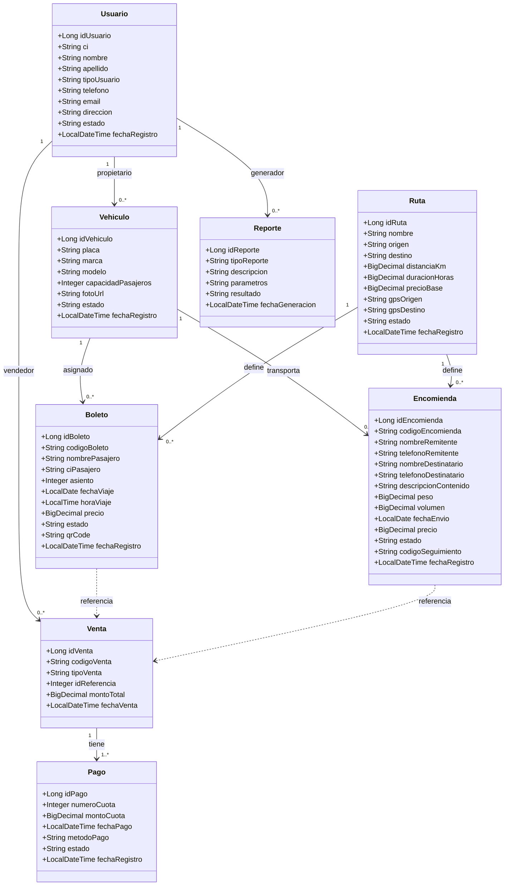

# Diagrama de Clases Simplificado - Sistema Trans Comarapa

## Diagrama Entidad-Relación (Mermaid)

```mermaid
classDiagram
    class Usuario {
        +Long idUsuario
        +String ci
        +String nombre
        +String apellido
        +String tipoUsuario
        +String telefono
        +String email
        +String direccion
        +String estado
        +LocalDateTime fechaRegistro
    }
    
    class Vehiculo {
        +Long idVehiculo
        +String placa
        +String marca
        +String modelo
        +Integer capacidadPasajeros
        +String fotoUrl
        +String estado
        +LocalDateTime fechaRegistro
    }
    
    class Ruta {
        +Long idRuta
        +String nombre
        +String origen
        +String destino
        +BigDecimal distanciaKm
        +BigDecimal duracionHoras
        +BigDecimal precioBase
        +String gpsOrigen
        +String gpsDestino
        +String estado
        +LocalDateTime fechaRegistro
    }
    
    class Boleto {
        +Long idBoleto
        +String codigoBoleto
        +String nombrePasajero
        +String ciPasajero
        +Integer asiento
        +LocalDate fechaViaje
        +LocalTime horaViaje
        +BigDecimal precio
        +String estado
        +String qrCode
        +LocalDateTime fechaRegistro
    }
    
    class Encomienda {
        +Long idEncomienda
        +String codigoEncomienda
        +String nombreRemitente
        +String telefonoRemitente
        +String nombreDestinatario
        +String telefonoDestinatario
        +String descripcionContenido
        +BigDecimal peso
        +BigDecimal volumen
        +LocalDate fechaEnvio
        +BigDecimal precio
        +String estado
        +String codigoSeguimiento
        +LocalDateTime fechaRegistro
    }
    
    class Venta {
        +Long idVenta
        +String codigoVenta
        +String tipoVenta
        +Integer idReferencia
        +BigDecimal montoTotal
        +LocalDateTime fechaVenta
    }
    
    class Pago {
        +Long idPago
        +Integer numeroCuota
        +BigDecimal montoCuota
        +LocalDateTime fechaPago
        +String metodoPago
        +String estado
        +LocalDateTime fechaRegistro
    }
    
    class Reporte {
        +Long idReporte
        +String tipoReporte
        +String descripcion
        +String parametros
        +String resultado
        +LocalDateTime fechaGeneracion
    }
    
    %% Relaciones
    Usuario "1" --> "0..*" Vehiculo : propietario
    Usuario "1" --> "0..*" Venta : vendedor
    Usuario "1" --> "0..*" Reporte : generador
    
    Vehiculo "1" --> "0..*" Boleto : asignado
    Vehiculo "1" --> "0..*" Encomienda : transporta
    
    Ruta "1" --> "0..*" Boleto : define
    Ruta "1" --> "0..*" Encomienda : define
    
    Venta "1" --> "1..*" Pago : tiene
    
    Boleto ..> Venta : referencia
    Encomienda ..> Venta : referencia
```
