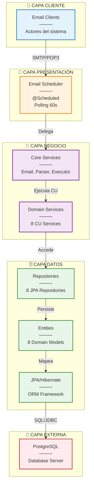
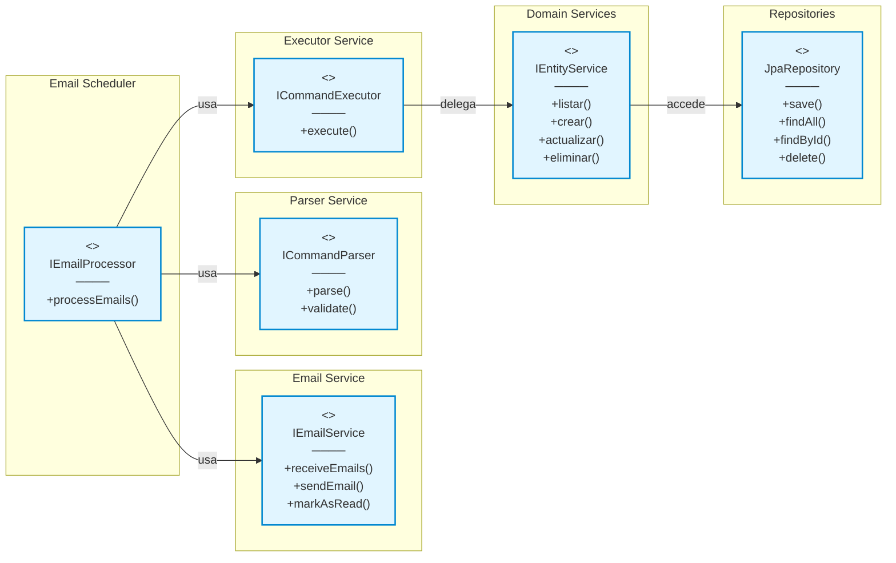
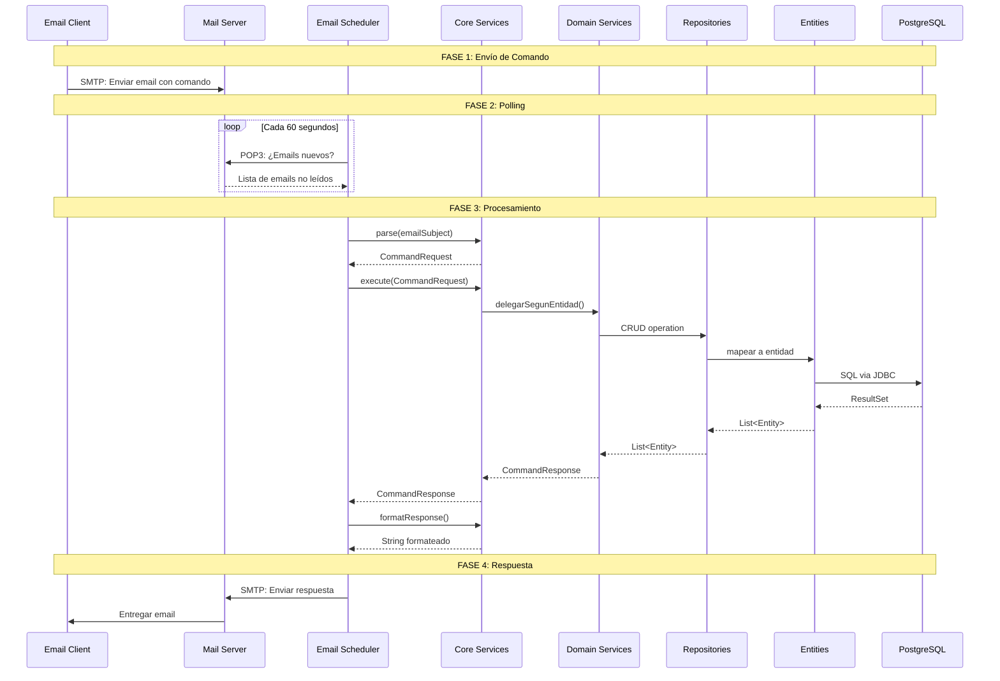
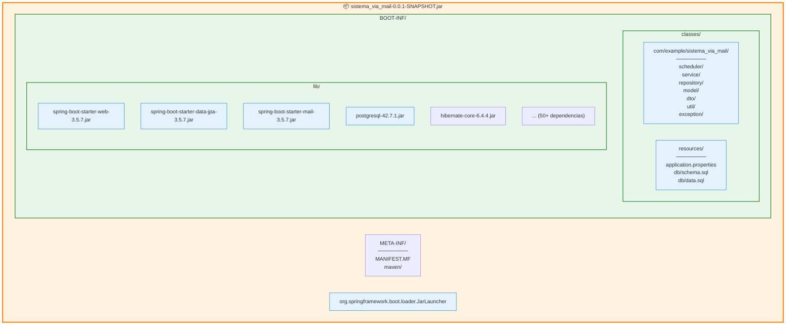
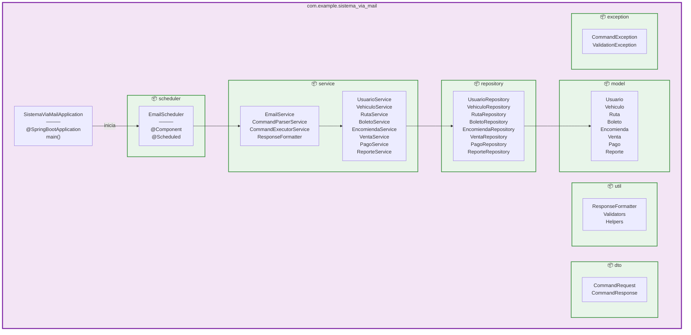
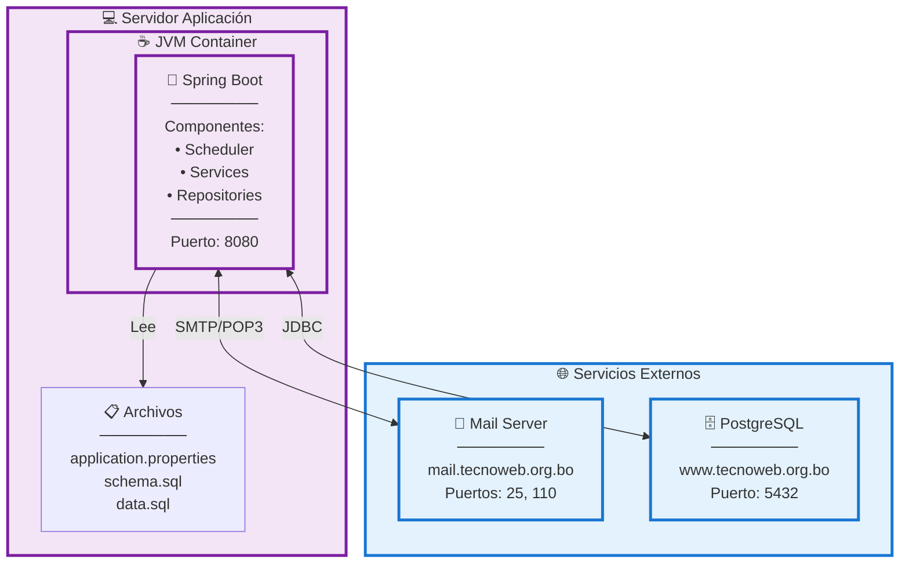

# Diagrama de Componentes - Sistema Trans Comarapa

## Resumen Ejecutivo

El sistema está organizado en **componentes modulares** siguiendo una arquitectura en capas con separación clara de responsabilidades, comunicación asíncrona vía email y persistencia en base de datos PostgreSQL.

```
Total de Componentes: 12
Componentes Core: 5
Componentes de Soporte: 4
Componentes Externos: 3
Patrón Arquitectónico: Layered Architecture + Service Layer
```

---

## Diagrama de Componentes Completo

```mermaid
graph TB
    subgraph EXTERNAL["🌐 COMPONENTES EXTERNOS"]
        EMAIL_CLIENT["📧 Email Client<br/>────────────<br/>Gmail/Outlook<br/>────────────<br/>Responsabilidad:<br/>• Envío de comandos<br/>• Recepción de respuestas<br/>────────────<br/>Interfaz:<br/>SMTP/IMAP"]
        
        MAIL_SERVER["📬 Mail Server<br/>────────────<br/>mail.tecnoweb.org.bo<br/>────────────<br/>Responsabilidad:<br/>• Gestión de emails<br/>• Almacenamiento temporal<br/>────────────<br/>Puertos:<br/>SMTP: 25<br/>POP3: 110"]
        
        DB_SERVER["🗄️ PostgreSQL Server<br/>────────────<br/>www.tecnoweb.org.bo<br/>────────────<br/>Responsabilidad:<br/>• Persistencia de datos<br/>• Transacciones ACID<br/>────────────<br/>Puerto: 5432<br/>Database: db_grupo04sa"]
    end
    
    subgraph SPRING_BOOT["🍃 SPRING BOOT APPLICATION"]
        
        subgraph PRESENTATION["📧 CAPA PRESENTACIÓN"]
            SCHEDULER["⏰ Email Scheduler<br/>────────────<br/>Component<br/>────────────<br/>Responsabilidad:<br/>• Polling cada 60s<br/>• Orquestación de flujo<br/>• Manejo de errores<br/>────────────<br/>Clases:<br/>EmailScheduler.java<br/>────────────<br/>@Scheduled(60000)"]
        end
        
        subgraph BUSINESS["💼 CAPA NEGOCIO"]
            CORE_SERVICES["🎯 Core Services<br/>────────────<br/>@Service<br/>────────────<br/>Responsabilidad:<br/>• EmailService<br/>• CommandParserService<br/>• CommandExecutorService<br/>────────────<br/>Clases: 3<br/>Métodos: ~25"]
            
            DOMAIN_SERVICES["📦 Domain Services<br/>────────────<br/>@Service<br/>────────────<br/>Responsabilidad:<br/>• UsuarioService (CU1)<br/>• VehiculoService (CU2)<br/>• RutaService (CU3)<br/>• BoletoService (CU4)<br/>• EncomiendaService (CU5)<br/>• VentaService (CU6)<br/>• PagoService (CU7)<br/>• ReporteService (CU8)<br/>────────────<br/>Clases: 8<br/>Métodos: ~60"]
        end
        
        subgraph DATA["🗂️ CAPA DATOS"]
            REPOSITORIES["🔍 Repositories<br/>────────────<br/>@Repository<br/>────────────<br/>Responsabilidad:<br/>• Acceso a BD<br/>• Queries JPA<br/>• CRUD operations<br/>────────────<br/>Interfaces: 8<br/>Extends: JpaRepository"]
            
            ENTITIES["📋 Entities<br/>────────────<br/>@Entity<br/>────────────<br/>Responsabilidad:<br/>• Modelo de dominio<br/>• Mapeo JPA<br/>• Validaciones<br/>────────────<br/>Clases: 8<br/>Tablas: 8"]
        end
        
        subgraph SUPPORT["🛠️ COMPONENTES SOPORTE"]
            DTO["💼 DTOs<br/>────────────<br/>POJOs<br/>────────────<br/>Responsabilidad:<br/>• CommandRequest<br/>• CommandResponse<br/>────────────<br/>Clases: 2"]
            
            UTIL["⚙️ Utilities<br/>────────────<br/>Helpers<br/>────────────<br/>Responsabilidad:<br/>• ResponseFormatter<br/>• Validators<br/>• Converters<br/>────────────<br/>Clases: 3"]
            
            EXCEPTION["⚠️ Exceptions<br/>────────────<br/>RuntimeException<br/>────────────<br/>Responsabilidad:<br/>• CommandException<br/>• ValidationException<br/>────────────<br/>Clases: 2"]
            
            CONFIG["⚙️ Configuration<br/>────────────<br/>@Configuration<br/>────────────<br/>Responsabilidad:<br/>• application.properties<br/>• Bean definitions<br/>────────────<br/>Files: 1+"]
        end
        
        subgraph PERSISTENCE["💾 CAPA PERSISTENCIA"]
            JPA["🔗 Spring Data JPA<br/>────────────<br/>Framework<br/>────────────<br/>Responsabilidad:<br/>• ORM (Hibernate)<br/>• Query generation<br/>• Transaction mgmt<br/>────────────<br/>Version: 3.5.7"]
            
            JDBC["🔌 JDBC Driver<br/>────────────<br/>PostgreSQL Driver<br/>────────────<br/>Responsabilidad:<br/>• Conexión a BD<br/>• Ejecutar SQL<br/>────────────<br/>Driver: postgresql"]
        end
    end
    
    %% ============ FLUJO DE COMUNICACIÓN ============
    
    EMAIL_CLIENT -->|"1. SMTP<br/>Envía comando"| MAIL_SERVER
    MAIL_SERVER -->|"2. POP3<br/>Poll emails"| SCHEDULER
    
    SCHEDULER -->|"3. Parsear"| CORE_SERVICES
    SCHEDULER -->|"4. Ejecutar"| CORE_SERVICES
    SCHEDULER -->|"5. Formatear"| UTIL
    SCHEDULER -->|"6. SMTP<br/>Enviar respuesta"| MAIL_SERVER
    
    CORE_SERVICES -->|"7. Delegar CU"| DOMAIN_SERVICES
    CORE_SERVICES -->|"8. Usar DTOs"| DTO
    CORE_SERVICES -->|"9. Lanzar errores"| EXCEPTION
    
    DOMAIN_SERVICES -->|"10. CRUD"| REPOSITORIES
    DOMAIN_SERVICES -->|"11. Validar"| ENTITIES
    
    REPOSITORIES -->|"12. JPA API"| JPA
    REPOSITORIES -->|"13. Gestionar"| ENTITIES
    
    JPA -->|"14. SQL"| JDBC
    JDBC -->|"15. TCP/IP<br/>Port 5432"| DB_SERVER
    
    MAIL_SERVER -->|"16. Entregar<br/>respuesta"| EMAIL_CLIENT
    
    CONFIG -.->|"Configura"| CORE_SERVICES
    CONFIG -.->|"Configura"| JPA
    CONFIG -.->|"Configura"| JDBC
    
    UTIL -.->|"Usa"| DTO
    
    classDef external fill:#e3f2fd,stroke:#1976d2,stroke-width:3px
    classDef presentation fill:#fff3e0,stroke:#f57c00,stroke-width:3px
    classDef business fill:#f3e5f5,stroke:#7b1fa2,stroke-width:3px
    classDef data fill:#e8f5e9,stroke:#388e3c,stroke-width:3px
    classDef support fill:#fff9c4,stroke:#f9a825,stroke-width:2px
    classDef persistence fill:#fce4ec,stroke:#c2185b,stroke-width:2px
    
    class EMAIL_CLIENT,MAIL_SERVER,DB_SERVER external
    class SCHEDULER presentation
    class CORE_SERVICES,DOMAIN_SERVICES business
    class REPOSITORIES,ENTITIES data
    class DTO,UTIL,EXCEPTION,CONFIG support
    class JPA,JDBC persistence
```



---

## Diagrama de Componentes Simplificado por Capas



---

## Descripción Detallada de Componentes

### 1. 📧 Email Scheduler (Presentación)

**Responsabilidad Principal:** Orquestar el flujo de procesamiento de emails.

**Clases:**
- `EmailScheduler.java`

**Funcionalidades:**
1. ⏰ **Polling Automático** - Ejecutar cada 60 segundos (`@Scheduled`)
2. 📬 **Recepción de Emails** - Obtener correos no leídos vía POP3
3. 🔄 **Orquestación** - Coordinar Parser → Executor → Formatter
4. 📤 **Envío de Respuestas** - Enviar emails con resultados
5. ⚠️ **Manejo de Errores** - Capturar y loggear excepciones

**Interfaces Proporcionadas:**
- `void processEmails()`

**Interfaces Requeridas:**
- `EmailService`
- `CommandParserService`
- `CommandExecutorService`
- `ResponseFormatter`

**Dependencias:**
```java
@Autowired EmailService emailService
@Autowired CommandParserService parserService
@Autowired CommandExecutorService executorService
@Autowired ResponseFormatter formatter
```

---

### 2. 🎯 Core Services (Negocio - Core)

**Responsabilidad Principal:** Servicios fundamentales del sistema.

**Componentes Internos:**

#### 2.1 EmailService
- **Función:** Gestión de correos electrónicos
- **Métodos:**
  - `List<Message> receiveEmails()` - Recibir emails vía POP3
  - `void sendEmail(String to, String subject, String body)` - Enviar vía SMTP
  - `void markAsRead(Message msg)` - Marcar email como leído

#### 2.2 CommandParserService
- **Función:** Análisis y parseo de comandos
- **Métodos:**
  - `CommandRequest parse(String subject)` - Parsear asunto del email
  - `boolean validateCommand(String cmd)` - Validar sintaxis
  - `Map<String,String> extractParameters(String params)` - Extraer parámetros

#### 2.3 CommandExecutorService
- **Función:** Ejecución de comandos y delegación a servicios CU
- **Métodos:**
  - `CommandResponse execute(CommandRequest req)` - Ejecutar comando
  - Delega a servicios específicos según entidad

**Interfaces Requeridas:**
- JavaMail API (externa)
- Domain Services
- DTOs

---

### 3. 📦 Domain Services (Negocio - Dominio)

**Responsabilidad Principal:** Implementar lógica de negocio de casos de uso.

**Componentes (8 servicios):**

| Componente | CU | Operaciones | LOC |
|------------|-----|-------------|-----|
| **UsuarioService** | CU1 | LISUSU, INSUSU, UPDUSU, DELUSU | ~200 |
| **VehiculoService** | CU2 | LISVEH, INSVEH, UPDVEH, DELVEH | ~200 |
| **RutaService** | CU3 | LISRUT, INSRUT, UPDRUT, DELRUT | ~200 |
| **BoletoService** | CU4 | LISBOL, INSBOL, UPDBOL, DELBOL | ~250 |
| **EncomiendaService** | CU5 | LISENC, INSENC, UPDENC, DELENC | ~250 |
| **VentaService** | CU6 | LISVEN, INSVEN | ~150 |
| **PagoService** | CU7 | LISPAG, INSPAG, UPDPAG | ~150 |
| **ReporteService** | CU8 | REPREP (5 tipos) | ~400 |

**Patrón Común:**
```java
@Service
public class XxxService {
    @Autowired XxxRepository repository;
    
    public List<Xxx> listar() { ... }
    public Xxx crear(Xxx entity) { ... }
    public Xxx actualizar(Long id, Xxx entity) { ... }
    public void eliminar(Long id) { ... }
}
```

**Interfaces Proporcionadas:**
- Métodos CRUD específicos por entidad
- Métodos de búsqueda custom

**Interfaces Requeridas:**
- Repositories
- Entities
- Exceptions

---

### 4. 🔍 Repositories (Datos - Acceso)

**Responsabilidad Principal:** Abstracción del acceso a datos.

**Componentes (8 interfaces):**
- `UsuarioRepository`
- `VehiculoRepository`
- `RutaRepository`
- `BoletoRepository`
- `EncomiendaRepository`
- `VentaRepository`
- `PagoRepository`
- `ReporteRepository`

**Patrón Común:**
```java
@Repository
public interface XxxRepository extends JpaRepository<Xxx, Long> {
    // Métodos custom
    Optional<Xxx> findByXxx(String xxx);
    List<Xxx> findByYyy(String yyy);
}
```

**Interfaces Proporcionadas:**
- CRUD heredado de JpaRepository: `save()`, `findAll()`, `findById()`, `delete()`
- Métodos custom por repositorio

**Interfaces Requeridas:**
- Spring Data JPA
- Entities

---

### 5. 📋 Entities (Datos - Modelo)

**Responsabilidad Principal:** Representar el modelo de dominio y mapeo JPA.

**Componentes (8 entidades):**
1. **Usuario** - 10 atributos
2. **Vehiculo** - 9 atributos
3. **Ruta** - 11 atributos
4. **Boleto** - 12 atributos
5. **Encomienda** - 16 atributos
6. **Venta** - 6 atributos
7. **Pago** - 8 atributos
8. **Reporte** - 6 atributos

**Patrón Común:**
```java
@Entity
@Table(name = "xxx")
public class Xxx {
    @Id
    @GeneratedValue(strategy = GenerationType.IDENTITY)
    private Long id;
    
    // Atributos con validaciones
    @NotBlank
    private String campo;
    
    // Relaciones
    @ManyToOne
    @JoinColumn(name = "id_yyy")
    private Yyy yyy;
    
    // Getters/Setters
}
```

**Anotaciones JPA:**
- `@Entity`, `@Table`, `@Id`, `@GeneratedValue`
- `@Column`, `@NotBlank`, `@Email`, `@Min`, `@Max`
- `@ManyToOne`, `@OneToMany`, `@JoinColumn`

---

### 6. 💼 DTOs (Soporte - Transferencia)

**Responsabilidad Principal:** Transferir datos entre capas.

**Componentes:**

#### CommandRequest
```java
public class CommandRequest {
    private String operation;      // LIS, INS, UPD, DEL, REP
    private String entity;         // USU, VEH, RUT, BOL, ENC, VEN, PAG, REP
    private Map<String,String> parameters;
    private String sender;
}
```

#### CommandResponse
```java
public class CommandResponse {
    private String status;         // SUCCESS, ERROR
    private String message;
    private Object data;
    private String fullCommand;
    
    public static CommandResponse success(String msg, Object data) { ... }
    public static CommandResponse error(String msg) { ... }
}
```

---

### 7. ⚙️ Utilities (Soporte - Utilidades)

**Responsabilidad Principal:** Funciones auxiliares reutilizables.

**Componentes:**

#### ResponseFormatter
- **Función:** Formatear respuestas para emails
- **Métodos:**
  - `String formatResponse(CommandResponse)` - Formatear respuesta completa
  - `String formatList(List<?>)` - Formatear listas
  - `String formatEntity(Object)` - Formatear entidad

#### Validators (Potencial)
- Validaciones complejas de negocio

#### Converters (Potencial)
- Conversiones de tipos

---

### 8. ⚠️ Exceptions (Soporte - Errores)

**Responsabilidad Principal:** Manejo centralizado de excepciones.

**Componentes:**

#### CommandException
```java
public class CommandException extends RuntimeException {
    public CommandException(String message) { ... }
    public CommandException(String message, Throwable cause) { ... }
}
```

#### ValidationException
```java
public class ValidationException extends RuntimeException {
    public ValidationException(String message) { ... }
}
```

**Jerarquía:**
```
RuntimeException (Java)
  └── CommandException
  └── ValidationException
```

---

### 9. ⚙️ Configuration (Soporte - Configuración)

**Responsabilidad Principal:** Configuración de la aplicación.

**Archivos:**

#### application.properties
```properties
# Database
spring.datasource.url=jdbc:postgresql://www.tecnoweb.org.bo:5432/db_grupo04sa
spring.datasource.username=grupo04sa
spring.datasource.password=********

# Email
spring.mail.host=mail.tecnoweb.org.bo
spring.mail.port=25
spring.mail.username=grupo04sa

# JPA
spring.jpa.hibernate.ddl-auto=update
spring.jpa.show-sql=true

# Scheduler
email.polling.interval=60000
```

---

### 10. 🔗 Spring Data JPA (Persistencia)

**Responsabilidad Principal:** Framework ORM para mapeo objeto-relacional.

**Funcionalidades:**
- 🔄 Generación automática de queries
- 💾 Gestión de transacciones
- 📊 Caching de segundo nivel
- 🔍 Query derivation (findByXxx)

**Interfaces:**
- `JpaRepository<T, ID>`
- `CrudRepository<T, ID>`
- `PagingAndSortingRepository<T, ID>`

**Motor ORM:** Hibernate 6.x

---

### 11. 🔌 JDBC Driver (Persistencia)

**Responsabilidad Principal:** Conectividad con PostgreSQL.

**Funcionalidades:**
- 🔗 Establecer conexiones TCP/IP
- 📤 Ejecutar sentencias SQL
- 📥 Recibir resultados
- 🔒 Manejo de transacciones

**Driver:** `org.postgresql.Driver`

**Configuración:**
```xml
<dependency>
    <groupId>org.postgresql</groupId>
    <artifactId>postgresql</artifactId>
    <scope>runtime</scope>
</dependency>
```

---

### 12. 🗄️ PostgreSQL Server (Externo)

**Responsabilidad Principal:** Persistencia permanente de datos.

**Características:**
- 🏛️ Base de datos relacional
- 🔒 Transacciones ACID
- 📊 8 tablas del dominio
- 🔐 Autenticación de usuario

**Conexión:**
```
Host: www.tecnoweb.org.bo
Port: 5432
Database: db_grupo04sa
User: grupo04sa
```

---

## Matriz de Dependencias entre Componentes

| Componente ↓ / Depende de → | Email Scheduler | Core Services | Domain Services | Repositories | Entities | DTOs | Utils | Exceptions | JPA | JDBC | External |
|----------------------------|-----------------|---------------|-----------------|--------------|----------|------|-------|------------|-----|------|----------|
| **Email Scheduler** | - | ✅ | - | - | - | ✅ | ✅ | - | - | - | ✅ |
| **Core Services** | - | - | ✅ | - | - | ✅ | ✅ | ✅ | - | - | ✅ |
| **Domain Services** | - | - | - | ✅ | ✅ | - | - | ✅ | - | - | - |
| **Repositories** | - | - | - | - | ✅ | - | - | - | ✅ | - | - |
| **Entities** | - | - | - | - | - | - | - | - | ✅ | - | - |
| **DTOs** | - | - | - | - | - | - | - | - | - | - | - |
| **Utils** | - | - | - | - | - | ✅ | - | - | - | - | - |
| **Exceptions** | - | - | - | - | - | - | - | - | - | - | - |
| **JPA** | - | - | - | - | - | - | - | - | - | ✅ | - |
| **JDBC** | - | - | - | - | - | - | - | - | - | - | ✅ |

**Análisis:**
- ✅ **Email Scheduler**: Más dependencias (punto de entrada)
- ✅ **DTOs, Entities, Exceptions**: Sin dependencias (base)
- ✅ **Domain Services**: Depende solo de capa inferior (buena separación)

---

## Diagrama de Interfaces entre Componentes



---

## Flujo de Datos entre Componentes



---

## Empaquetado Físico (JAR)



**Estructura:**
```
sistema_via_mail-0.0.1-SNAPSHOT.jar
├── BOOT-INF/
│   ├── classes/                    # Clases compiladas
│   │   ├── com/example/sistema_via_mail/
│   │   └── application.properties
│   └── lib/                        # Dependencias
│       ├── spring-boot-*.jar
│       ├── postgresql-*.jar
│       └── ...
├── META-INF/
│   └── MANIFEST.MF
└── org/springframework/boot/loader/
```

---

## Distribución de Componentes por Package



---

## Componentes y Sus Responsabilidades (Resumen)

| Componente | Tipo | Clases | Responsabilidad Principal | Complejidad |
|------------|------|--------|---------------------------|-------------|
| **Email Scheduler** | Presentación | 1 | Orquestación del flujo | ⭐⭐⭐ Media |
| **Core Services** | Negocio | 3 | Email, Parser, Executor | ⭐⭐⭐⭐ Alta |
| **Domain Services** | Negocio | 8 | Lógica de CU | ⭐⭐⭐⭐⭐ Muy Alta |
| **Repositories** | Datos | 8 | Acceso a BD | ⭐⭐ Baja |
| **Entities** | Datos | 8 | Modelo de dominio | ⭐⭐⭐ Media |
| **DTOs** | Soporte | 2 | Transferencia de datos | ⭐ Muy Baja |
| **Utilities** | Soporte | 3 | Funciones auxiliares | ⭐⭐ Baja |
| **Exceptions** | Soporte | 2 | Manejo de errores | ⭐ Muy Baja |
| **Configuration** | Soporte | 1+ | Configuración | ⭐⭐ Baja |
| **JPA** | Framework | - | ORM | - |
| **JDBC** | Framework | - | Conectividad BD | - |
| **PostgreSQL** | Externo | - | Persistencia | - |

---

## Patrones Arquitectónicos Implementados

| Patrón | Componentes Involucrados | Beneficio |
|--------|--------------------------|-----------|
| **Layered Architecture** | Presentación → Negocio → Datos | Separación de responsabilidades |
| **Service Layer** | Domain Services | Encapsular lógica de negocio |
| **Repository Pattern** | Repositories | Abstracción de persistencia |
| **DTO Pattern** | CommandRequest/Response | Desacoplamiento de capas |
| **Dependency Injection** | Todos los @Autowired | Inversión de control |
| **Command Pattern** | CommandExecutor | Encapsular operaciones |
| **Template Method** | JpaRepository | Reutilización de código |
| **Scheduler Pattern** | EmailScheduler | Tareas programadas |
| **Active Record** | Entities con JPA | Mapeo objeto-relacional |

---

## Puntos de Extensión del Sistema

### 1. Nuevos Casos de Uso
**Componentes a modificar:**
- ✅ Crear nuevo `XxxService` en `service`
- ✅ Crear nuevo `XxxRepository` en `repository`
- ✅ Crear nueva entidad `Xxx` en `model`
- ✅ Agregar case en `CommandExecutorService`

### 2. Nuevos Protocolos de Comunicación
**Componentes a modificar:**
- ✅ Crear nuevo Scheduler (e.g., `RestApiScheduler`)
- ✅ Mantener `CommandExecutorService` sin cambios
- ✅ Reutilizar Domain Services

### 3. Nuevas Fuentes de Datos
**Componentes a modificar:**
- ✅ Cambiar configuración JPA
- ✅ Mantener Repositories sin cambios (abstracción)
- ✅ Posible ajuste en Entities

---

## Métricas de Componentes

| Métrica | Valor |
|---------|-------|
| **Total de Componentes Lógicos** | 12 |
| **Componentes Core** | 5 |
| **Componentes de Soporte** | 4 |
| **Componentes Externos** | 3 |
| **Clases Totales** | ~40 |
| **Interfaces** | 8 (Repositories) |
| **Líneas de Código** | ~5,000 |
| **Dependencias Maven** | ~50 |
| **Tamaño JAR** | ~50 MB |

---

## Recomendaciones de Mejora

### ✅ Implementado Correctamente
1. ✅ Separación clara de componentes por responsabilidad
2. ✅ Bajo acoplamiento entre capas
3. ✅ Alta cohesión dentro de componentes
4. ✅ Uso de interfaces para abstracción
5. ✅ Inyección de dependencias consistente

### 🔧 Mejoras Sugeridas
1. **Componente de Seguridad** - Agregar `SecurityService` para autenticación
2. **Componente de Cache** - Implementar `CacheService` con Redis
3. **Componente de Logging** - Centralizar logs con `LoggingAspect` (AOP)
4. **Componente de Validación** - Separar `ValidationService` del util
5. **Componente de Notificaciones** - Agregar `NotificationService` (SMS, Push)
6. **API REST** - Agregar `RestController` como alternativa al email
7. **Testing** - Componentes de test unitario e integración
8. **Monitoring** - Integrar Spring Boot Actuator para métricas

---

## Diagrama de Deployment de Componentes



---

## Checklist de Componentes

- [x] **Email Scheduler** - Implementado y funcional
- [x] **Email Service** - Implementado con JavaMail
- [x] **Command Parser** - Implementado con regex
- [x] **Command Executor** - Implementado con switch/case
- [x] **8 Domain Services** - Todos implementados (CU1-CU8)
- [x] **8 Repositories** - Todos extendiendo JpaRepository
- [x] **8 Entities** - Todos con validaciones JPA
- [x] **DTOs** - CommandRequest y CommandResponse
- [x] **Utilities** - ResponseFormatter implementado
- [x] **Exceptions** - CommandException y ValidationException
- [x] **Configuration** - application.properties configurado
- [x] **JPA Integration** - Hibernate funcionando
- [ ] **Security Component** - Pendiente
- [ ] **Cache Component** - Pendiente
- [ ] **REST API** - Pendiente
- [ ] **Testing Components** - Pendiente
