# Diagrama de Comunicación - CU1: Gestión de Usuarios

## Diagrama Resumido - Flujo General CU1

## Diagrama Detallado - LISUSU (Listar Usuarios)

```mermaid
sequenceDiagram
    participant U as 👤 Usuario
    participant E as 📧 Email System
    participant P as 🔍 Parser
    participant US as 👥 UsuarioService
    participant DB as 💾 DB
    
    U->>E: LISUSU["*"]
    E->>P: parse()
    P-->>E: CommandRequest
    E->>US: processCommand()
    US->>DB: findAll()
    DB-->>US: List<Usuario>
    US-->>E: CommandResponse
    E-->>U: Lista de 8 usuarios
```

## Diagrama Detallado - INSUSU (Insertar Usuario)

```mermaid
sequenceDiagram
    participant U as 👤 Usuario
    participant E as 📧 Email System
    participant US as 👥 UsuarioService
    participant DB as 💾 DB
    
    U->>E: INSUSU["CI","nombre","apellido","tipo"]
    E->>US: processCommand()
    US->>DB: findByCi() - Verificar duplicado
    DB-->>US: Optional.empty()
    US->>DB: save(usuario)
    DB-->>US: Usuario (id=9)
    US-->>E: SUCCESS
    E-->>U: "Usuario registrado"
```

## Diagrama Detallado - UPDUSU (Actualizar)

## Diagrama Detallado - DELUSU (Eliminar)

## Flujo de Objetos y Mensajes

## Matriz de Responsabilidades CU1

| Componente | Responsabilidad | Datos de Entrada | Datos de Salida |
|------------|----------------|------------------|-----------------|
| **EmailScheduler** | Coordinar flujo | Email Message | - |
| **EmailService** | Recibir/Enviar emails | - | List<EmailMessage> |
| **CommandParser** | Parsear comando | Subject String | CommandRequest |
| **CommandExecutor** | Delegar a servicio | CommandRequest | CommandResponse |
| **UsuarioService** | Lógica de negocio CU1 | CommandRequest | CommandResponse |
| **UsuarioRepository** | Persistencia | Usuario Entity | Usuario / List / void |
| **ResponseFormatter** | Formatear respuesta | CommandResponse | String (email body) |

## Comandos CU1 Implementados

| Comando | Operación | Parámetros | Ejemplo |
|---------|-----------|------------|---------|
| **LISUSU** | Listar | `["*"]` o `["CI"]` o `["TIPO"]` | `LISUSU["*"]` |
| **INSUSU** | Insertar | `["ci","nombre","apellido","tipo",...]` | `INSUSU["9876543","Pedro","Gomez","CONDUCTOR"]` |
| **UPDUSU** | Actualizar | `["ci","campo","valor"]` | `UPDUSU["9876543","estado","INACTIVO"]` |
| **DELUSU** | Eliminar | `["ci"]` | `DELUSU["9876543"]` |
