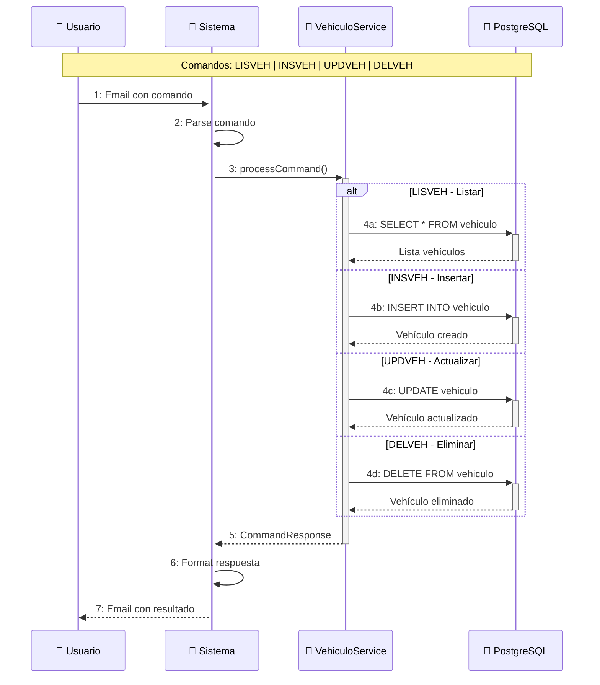
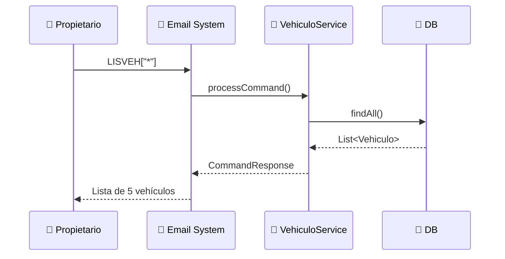
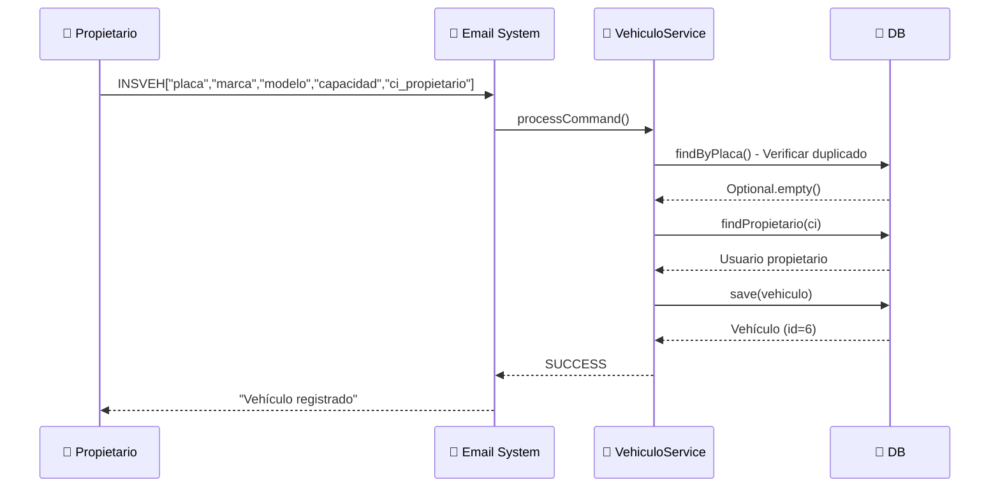
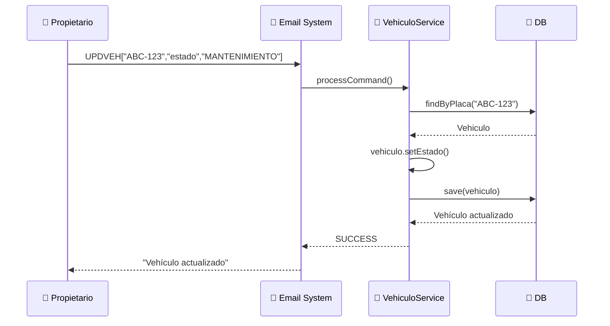
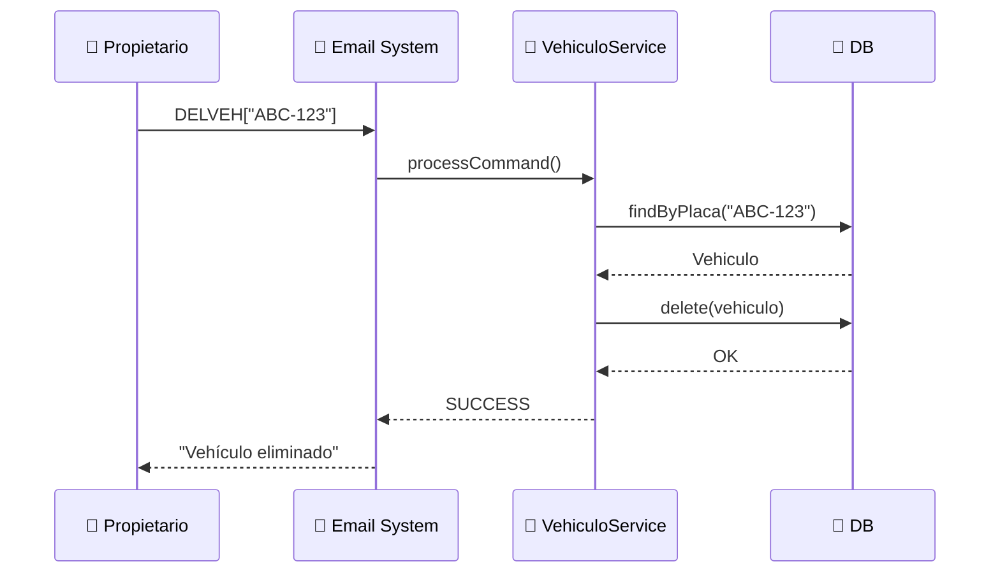

# Diagrama de Comunicación - CU2: Gestión de Vehículos

## Diagrama Resumido - Flujo General CU2

## Diagrama Detallado - LISVEH (Listar Vehículos)

## Diagrama Detallado - INSVEH (Insertar Vehículo)

## Diagrama Detallado - UPDVEH (Actualizar Vehículo)

## Diagrama Detallado - DELVEH (Eliminar Vehículo)

## Comandos CU2 Implementados

| Comando | Operación | Parámetros | Ejemplo |
|---------|-----------|------------|---------|
| **LISVEH** | Listar | `["*"]` o `["placa"]` | `LISVEH["*"]` |
| **INSVEH** | Insertar | `["placa","marca","modelo","capacidad","ci_propietario"]` | `INSVEH["XYZ-999","Toyota","Hiace","15","1234567"]` |
| **UPDVEH** | Actualizar | `["placa","campo","valor"]` | `UPDVEH["ABC-123","estado","MANTENIMIENTO"]` |
| **DELVEH** | Eliminar | `["placa"]` | `DELVEH["ABC-123"]` |
