# Diagrama de Comunicación - CU2: Gestión de Vehículos

## Diagrama Resumido - Flujo General CU2

## Diagrama Detallado - LISVEH (Listar Vehículos)

```mermaid
sequenceDiagram
    participant U as 👤 Propietario
    participant E as 📧 Email System
    participant VS as 🚐 VehiculoService
    participant DB as 💾 DB
    
    U->>E: LISVEH["*"]
    E->>VS: processCommand()
    VS->>DB: findAll()
    DB-->>VS: List<Vehiculo>
    VS-->>E: CommandResponse
    E-->>U: Lista de 5 vehículos
```

## Diagrama Detallado - INSVEH (Insertar Vehículo)

## Diagrama Detallado - UPDVEH (Actualizar Vehículo)

```mermaid
sequenceDiagram
    participant U as 👤 Propietario
    participant E as 📧 Email System
    participant VS as 🚐 VehiculoService
    participant DB as 💾 DB
    
    U->>E: UPDVEH["ABC-123","estado","MANTENIMIENTO"]
    E->>VS: processCommand()
    VS->>DB: findByPlaca("ABC-123")
    DB-->>VS: Vehiculo
    VS->>VS: vehiculo.setEstado()
    VS->>DB: save(vehiculo)
    DB-->>VS: Vehículo actualizado
    VS-->>E: SUCCESS
    E-->>U: "Vehículo actualizado"
```

## Diagrama Detallado - DELVEH (Eliminar Vehículo)

```mermaid
sequenceDiagram
    participant U as 👤 Propietario
    participant E as 📧 Email System
    participant VS as 🚐 VehiculoService
    participant DB as 💾 DB
    
    U->>E: DELVEH["ABC-123"]
    E->>VS: processCommand()
    VS->>DB: findByPlaca("ABC-123")
    DB-->>VS: Vehiculo
    VS->>DB: delete(vehiculo)
    DB-->>VS: OK
    VS-->>E: SUCCESS
    E-->>U: "Vehículo eliminado"
```

## Comandos CU2 Implementados

| Comando | Operación | Parámetros | Ejemplo |
|---------|-----------|------------|---------|
| **LISVEH** | Listar | `["*"]` o `["placa"]` | `LISVEH["*"]` |
| **INSVEH** | Insertar | `["placa","marca","modelo","capacidad","ci_propietario"]` | `INSVEH["XYZ-999","Toyota","Hiace","15","1234567"]` |
| **UPDVEH** | Actualizar | `["placa","campo","valor"]` | `UPDVEH["ABC-123","estado","MANTENIMIENTO"]` |
| **DELVEH** | Eliminar | `["placa"]` | `DELVEH["ABC-123"]` |
