# Diagrama de Comunicación - CU3: Gestión de Rutas

## Diagrama Resumido - Flujo General CU3

```mermaid
sequenceDiagram
    participant U as 👤 Usuario
    participant S as 📧 Sistema
    participant RS as 🗺️ RutaService
    participant DB as 💾 PostgreSQL
    
    Note over U,DB: Comandos: LISRUT | INSRUT | UPDRUT | DELRUT
    
    U->>+S: 1: Email con comando
    S->>S: 2: Parse comando
    S->>+RS: 3: processCommand()
    
    alt LISRUT - Listar
        RS->>+DB: 4a: SELECT * FROM ruta
        DB-->>-RS: Lista rutas
    else INSRUT - Insertar
        RS->>+DB: 4b: INSERT INTO ruta (incluye GPS)
        DB-->>-RS: Ruta creada
    else UPDRUT - Actualizar
        RS->>+DB: 4c: UPDATE ruta
        DB-->>-RS: Ruta actualizada
    else DELRUT - Eliminar
        RS->>+DB: 4d: DELETE FROM ruta
        DB-->>-RS: Ruta eliminada
    end
    
    RS-->>-S: 5: CommandResponse
    S->>S: 6: Format respuesta
    S-->>U: 7: Email con resultado
```

## Diagrama Detallado - LISRUT (Listar Rutas)

```mermaid
sequenceDiagram
    participant U as 👤 Secretaria
    participant E as 📧 Email System
    participant RS as 🗺️ RutaService
    participant DB as 💾 DB
    
    U->>E: LISRUT["*"]
    E->>RS: processCommand()
    RS->>DB: findAll()
    DB-->>RS: List<Ruta>
    RS-->>E: CommandResponse
    E-->>U: Lista de 5 rutas con GPS
```

## Diagrama Detallado - INSRUT (Insertar Ruta con GPS)

```mermaid
sequenceDiagram
    participant U as 👤 Secretaria
    participant E as 📧 Email System
    participant RS as 🗺️ RutaService
    participant DB as 💾 DB
    
    U->>E: INSRUT["nombre","origen","destino","precio","gps_origen","gps_destino"]
    E->>RS: processCommand()
    RS->>RS: Validar coordenadas GPS
    RS->>DB: save(ruta)
    DB-->>RS: Ruta (id=6)
    RS-->>E: SUCCESS + datos GPS
    E-->>U: "Ruta registrada con coordenadas"
```

## Diagrama Detallado - UPDRUT (Actualizar Ruta)

```mermaid
sequenceDiagram
    participant U as 👤 Secretaria
    participant E as 📧 Email System
    participant RS as 🗺️ RutaService
    participant DB as 💾 DB
    
    U->>E: UPDRUT["1","precio","60.00"]
    E->>RS: processCommand()
    RS->>DB: findById(1)
    DB-->>RS: Ruta
    RS->>RS: ruta.setPrecioBase(60.00)
    RS->>DB: save(ruta)
    DB-->>RS: Ruta actualizada
    RS-->>E: SUCCESS
    E-->>U: "Ruta actualizada"
```

## Diagrama Detallado - DELRUT (Eliminar Ruta)

```mermaid
sequenceDiagram
    participant U as 👤 Secretaria
    participant E as 📧 Email System
    participant RS as 🗺️ RutaService
    participant DB as 💾 DB
    
    U->>E: DELRUT["6"]
    E->>RS: processCommand()
    RS->>DB: findById(6)
    DB-->>RS: Ruta
    RS->>DB: delete(ruta)
    DB-->>RS: OK
    RS-->>E: SUCCESS
    E-->>U: "Ruta eliminada"
```

## Comandos CU3 Implementados

| Comando | Operación | Parámetros | Ejemplo |
|---------|-----------|------------|---------|
| **LISRUT** | Listar | `["*"]` o `["id"]` | `LISRUT["*"]` |
| **INSRUT** | Insertar | `["nombre","origen","destino","precio","gps_o","gps_d"]` | `INSRUT["SCZ-Vallegrande","Santa Cruz","Vallegrande","80.00","-17.78,-63.18","-18.48,-64.10"]` |
| **UPDRUT** | Actualizar | `["id","campo","valor"]` | `UPDRUT["1","precio","60.00"]` |
| **DELRUT** | Eliminar | `["id"]` | `DELRUT["6"]` |
