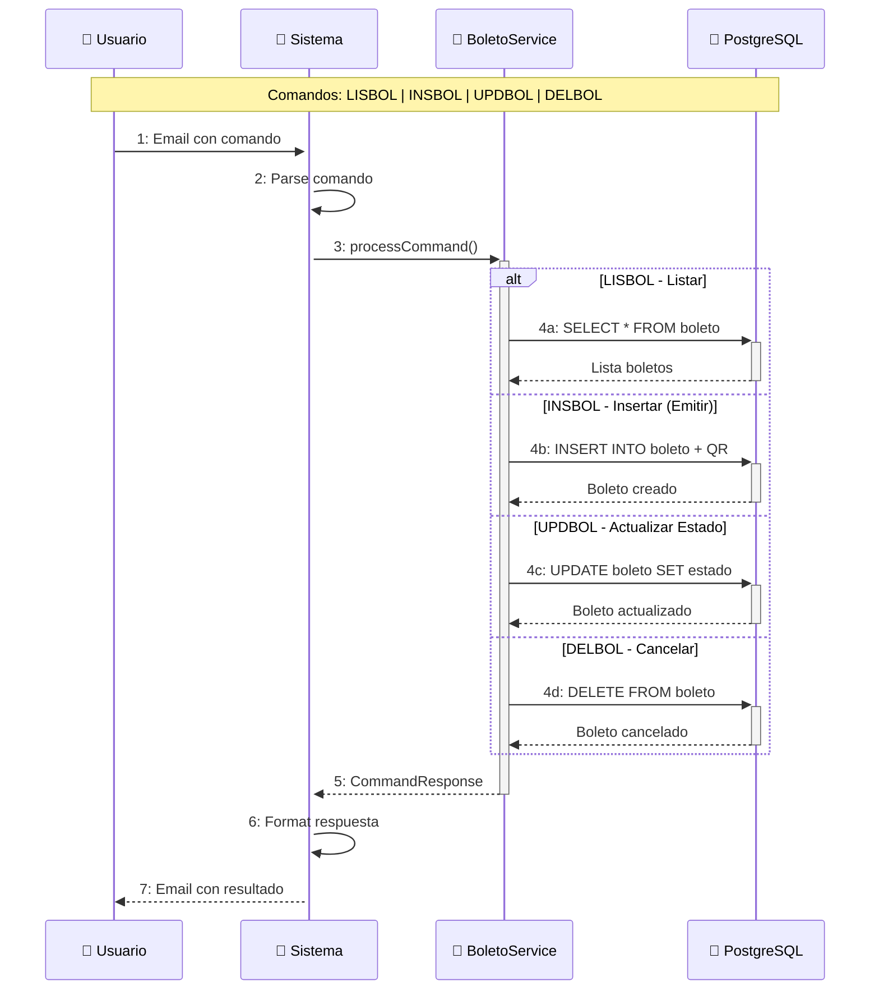
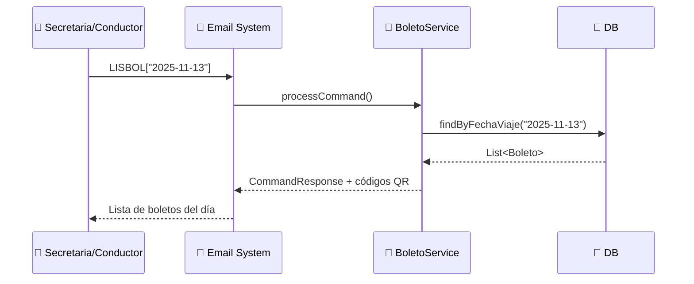
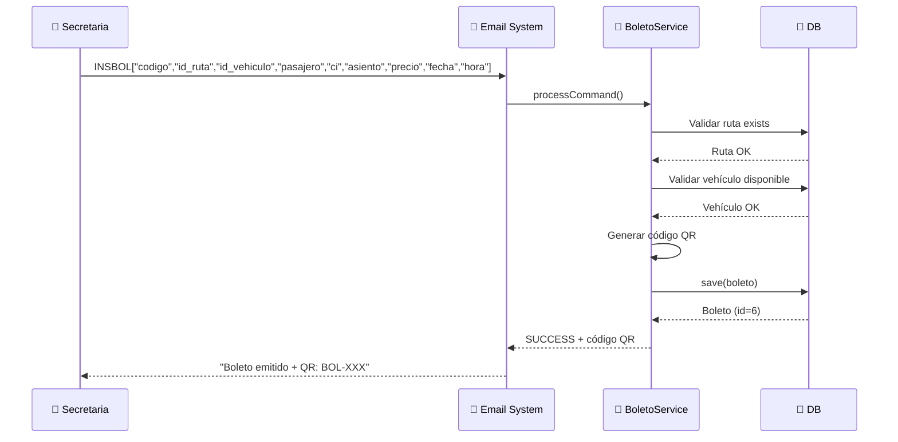
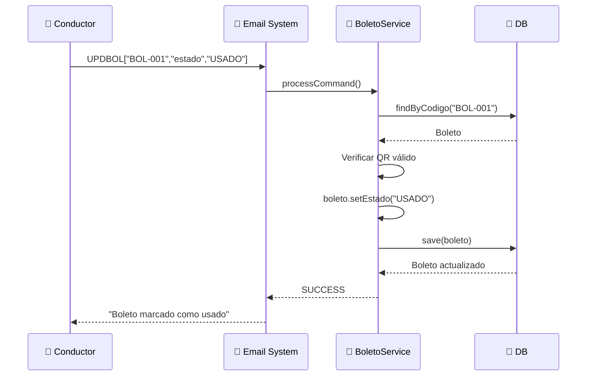
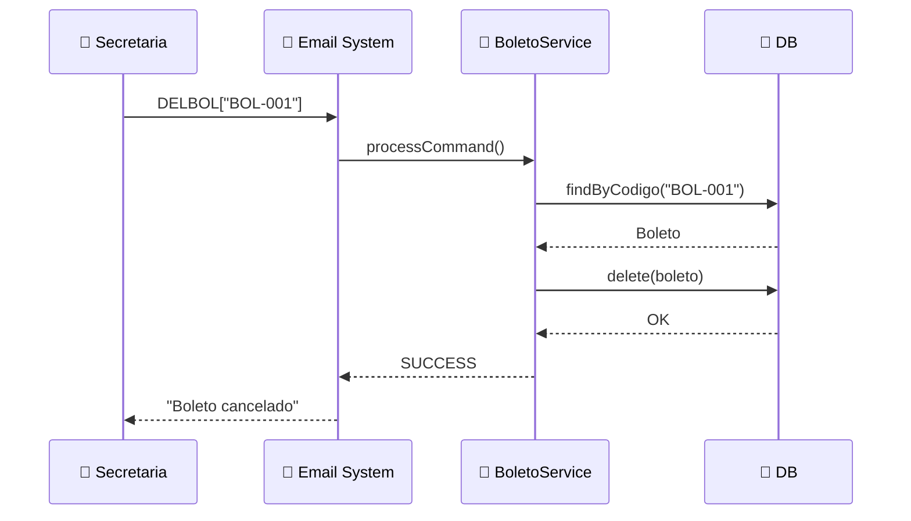

# Diagrama de Comunicación - CU4: Gestión de Boletos

## Diagrama Resumido - Flujo General CU4

## Diagrama Detallado - LISBOL (Listar Boletos)

## Diagrama Detallado - INSBOL (Emitir Boleto con QR)

## Diagrama Detallado - UPDBOL (Actualizar Estado)

## Diagrama Detallado - DELBOL (Cancelar Boleto)

## Comandos CU4 Implementados

| Comando | Operación | Parámetros | Ejemplo |
|---------|-----------|------------|---------|
| **LISBOL** | Listar | `["*"]` o `["codigo"]` o `["fecha"]` | `LISBOL["2025-11-13"]` |
| **INSBOL** | Emitir | `["codigo","id_ruta","id_vehiculo","pasajero","ci","asiento","precio","fecha","hora"]` | `INSBOL["BOL-006","1","1","Juan Perez","9876543","5","50.00","2025-11-15","08:00"]` |
| **UPDBOL** | Actualizar | `["codigo","estado","nuevo_estado"]` | `UPDBOL["BOL-001","estado","USADO"]` |
| **DELBOL** | Cancelar | `["codigo"]` | `DELBOL["BOL-001"]` |

## Características Especiales CU4

- ✅ **Generación de códigos QR** para cada boleto
- ✅ **Validación de asientos** disponibles
- ✅ **Validación de ruta y vehículo** activos
- ✅ **Control de estados:** VENDIDO → USADO → CANCELADO
