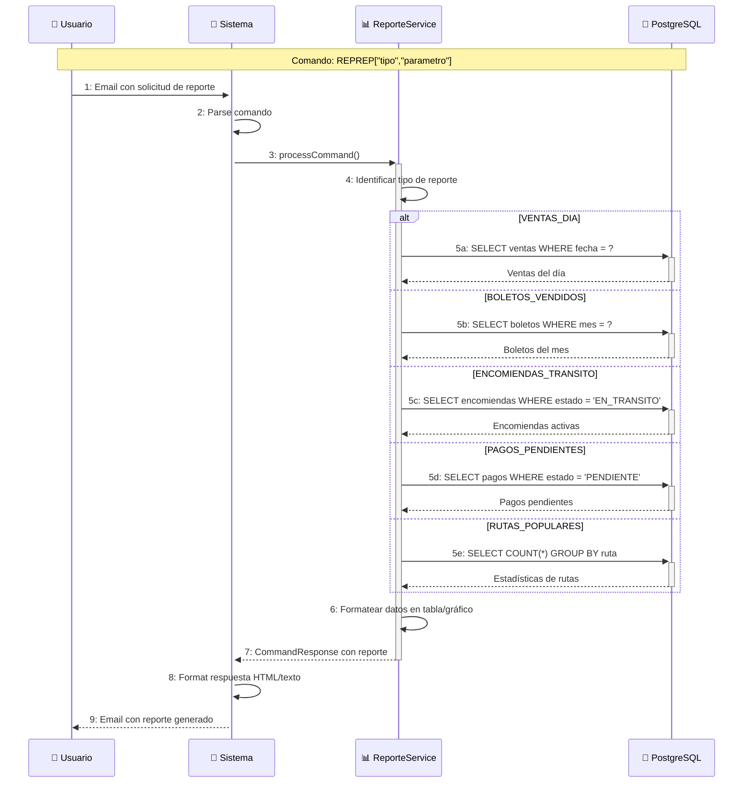
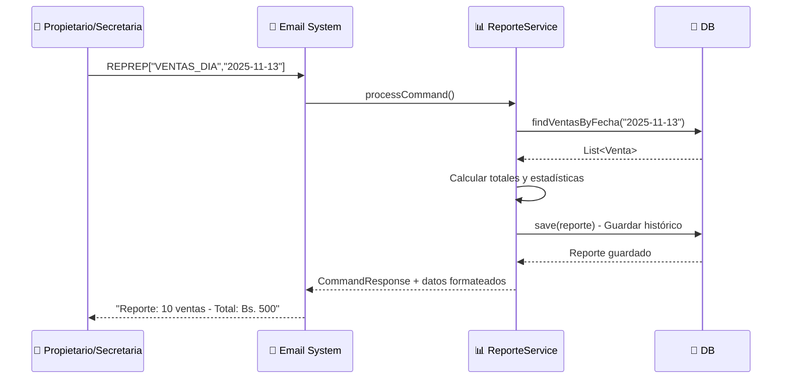
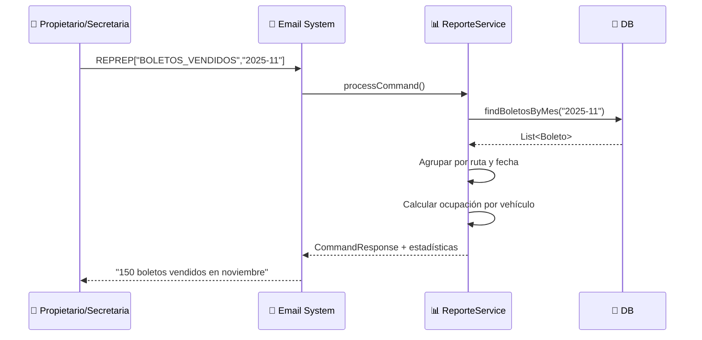
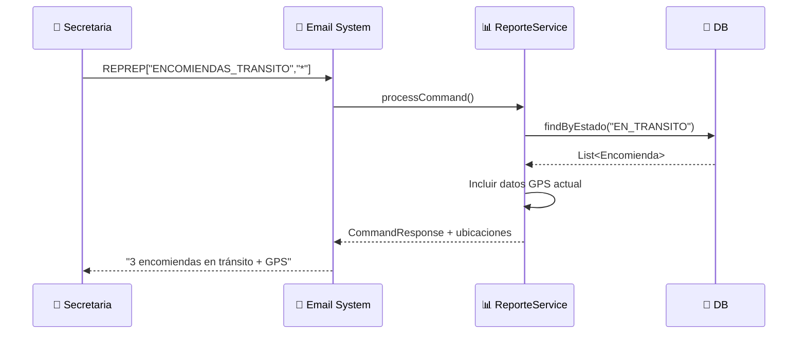
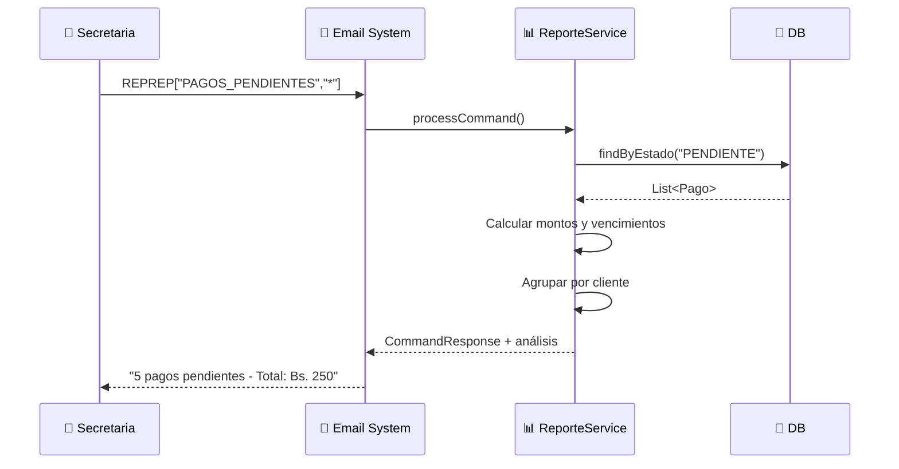
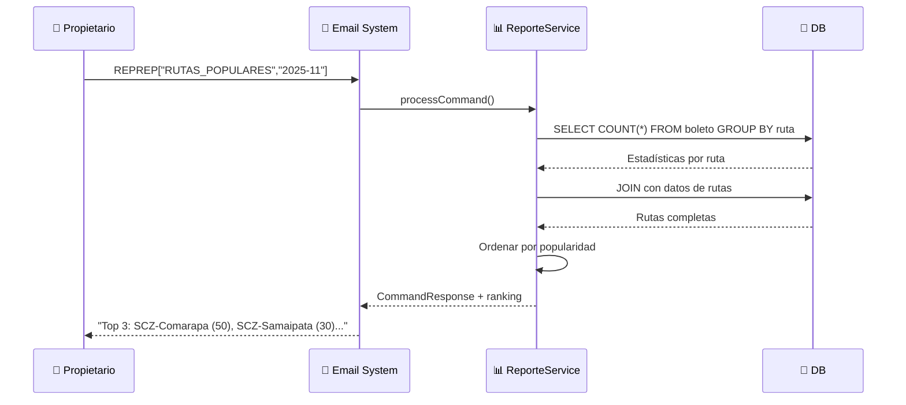
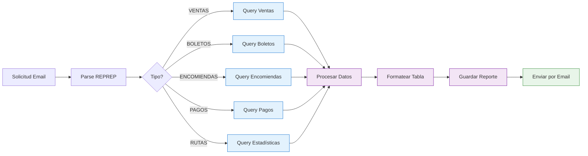

# Diagrama de Comunicación - CU8: Reportes y Estadísticas

## Diagrama Resumido - Flujo General CU8

## Diagrama Detallado - REPREP VENTAS_DIA

## Diagrama Detallado - REPREP BOLETOS_VENDIDOS

## Diagrama Detallado - REPREP ENCOMIENDAS_TRANSITO

## Diagrama Detallado - REPREP PAGOS_PENDIENTES

## Diagrama Detallado - REPREP RUTAS_POPULARES

## Tipos de Reportes Disponibles

| Tipo de Reporte | Parámetro | Descripción | Ejemplo |
|----------------|-----------|-------------|---------|
| **VENTAS_DIA** | Fecha (YYYY-MM-DD) | Ventas de un día específico | `REPREP["VENTAS_DIA","2025-11-13"]` |
| **BOLETOS_VENDIDOS** | Mes (YYYY-MM) | Boletos vendidos en el mes | `REPREP["BOLETOS_VENDIDOS","2025-11"]` |
| **ENCOMIENDAS_TRANSITO** | `*` | Encomiendas actualmente en tránsito | `REPREP["ENCOMIENDAS_TRANSITO","*"]` |
| **PAGOS_PENDIENTES** | `*` | Pagos que están pendientes | `REPREP["PAGOS_PENDIENTES","*"]` |
| **RUTAS_POPULARES** | Mes (YYYY-MM) | Rutas más utilizadas | `REPREP["RUTAS_POPULARES","2025-11"]` |

## Flujo de Generación de Reportes

## Características Especiales CU8

- ✅ **Reportes históricos** guardados en tabla `reporte`
- ✅ **Datos estadísticos** con totales, promedios y agrupaciones
- ✅ **Formato tabular** fácil de leer en email
- ✅ **Parámetros flexibles** (fecha, mes, todos)
- ✅ **Múltiples tipos** de análisis disponibles
