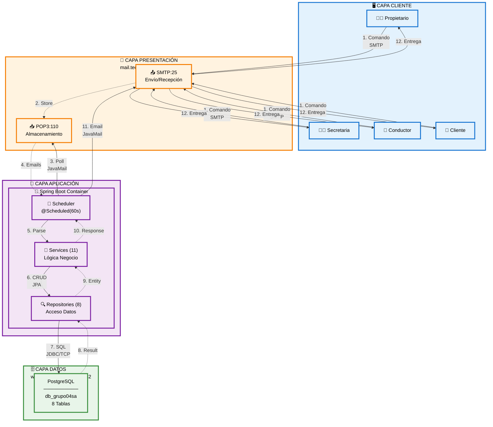
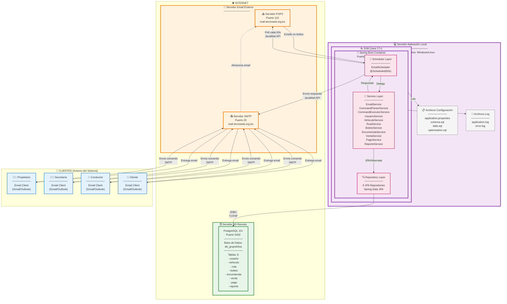
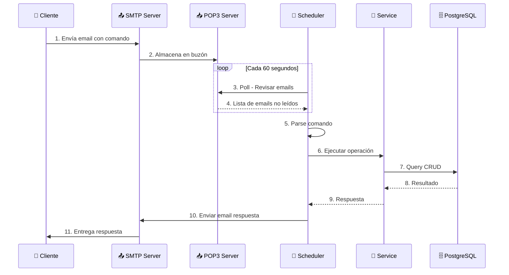
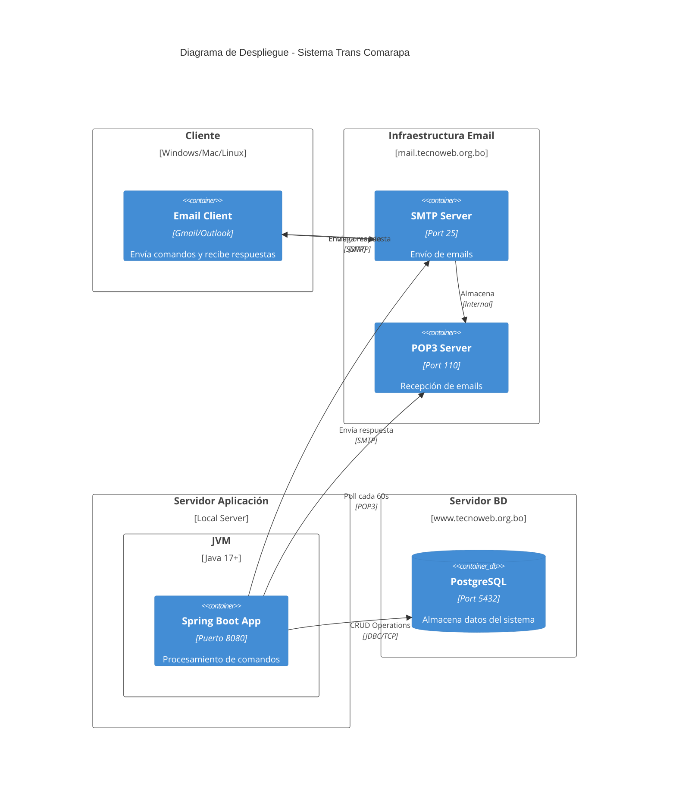
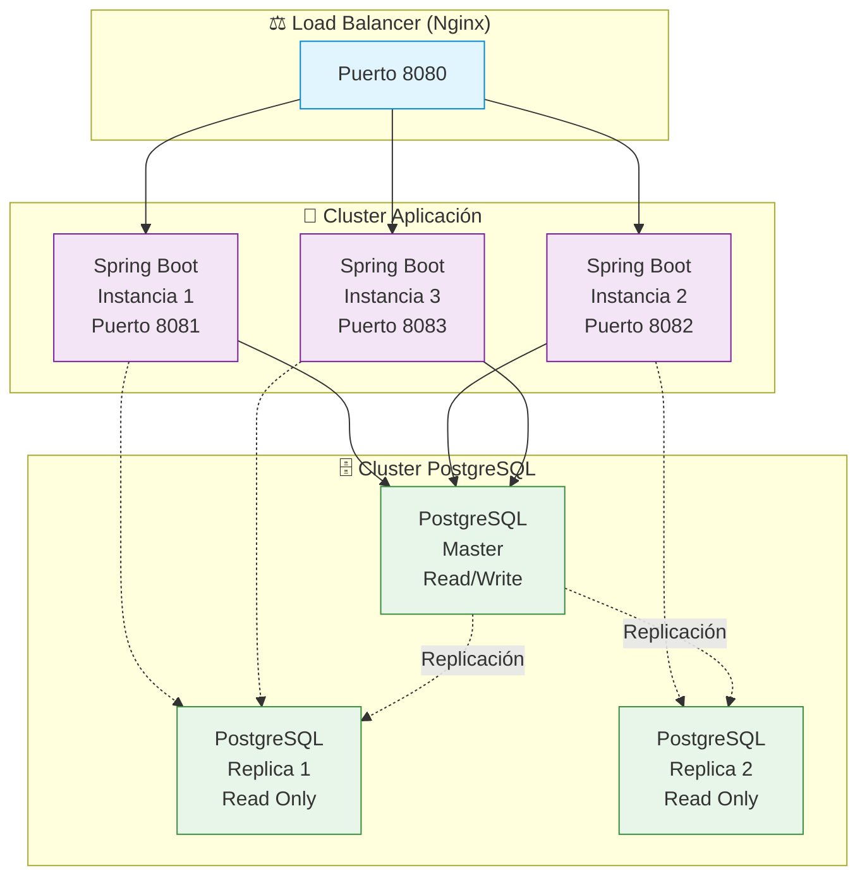

# Diagrama de Despliegue - Sistema Trans Comarapa

## Resumen Ejecutivo

El sistema utiliza una **arquitectura cliente-servidor de 3 capas** con comunicación asíncrona vía email, desplegado en infraestructura híbrida (servidor local + servicios externos).

---

## Diagrama de Despliegue por Capas (Resumido)



### Descripción de Capas

| Capa | Tecnología | Ubicación | Función Principal |
|------|------------|-----------|-------------------|
| **🖥️ Cliente** | Email Client (Gmail/Outlook) | Dispositivo usuario | Envío de comandos y recepción de respuestas |
| **📧 Presentación** | SMTP/POP3 Server | mail.tecnoweb.org.bo | Gestión de correos electrónicos |
| **💼 Aplicación** | Spring Boot 3.5.7 + Java 17 | Servidor Local:8080 | Procesamiento de lógica de negocio |
| **🗄️ Datos** | PostgreSQL 13+ | www.tecnoweb.org.bo:5432 | Persistencia de información |

---

## Diagrama de Despliegue Completo



---

## Componentes de Despliegue

### 1. 👥 Clientes (Email Clients)

| Actor | Cliente Email | Operaciones Permitidas |
|-------|---------------|------------------------|
| Propietario | Gmail/Outlook/Thunderbird | Todos los CU (1-8) |
| Secretaria | Gmail/Outlook/Thunderbird | CU1, CU4, CU5, CU6, CU7 |
| Conductor | Gmail/Outlook/Thunderbird | CU2, CU3, CU4, CU5 |
| Cliente | Gmail/Outlook/Thunderbird | CU4 (consulta), CU5 (consulta) |

**Requisitos:**
- Conexión a Internet
- Cliente de correo compatible con SMTP/POP3
- Formato de comando correcto en asunto

---

### 2. 📧 Servidor Email Externo (mail.tecnoweb.org.bo)

#### Servidor POP3
- **Puerto:** 110
- **Protocolo:** POP3 (Post Office Protocol v3)
- **Función:** Almacenar emails entrantes
- **Acceso:** Sistema Trans Comarapa lee cada 60 segundos

#### Servidor SMTP
- **Puerto:** 25
- **Protocolo:** SMTP (Simple Mail Transfer Protocol)
- **Función:** Enviar/recibir emails
- **Uso:** 
  - Recepción de comandos de clientes
  - Envío de respuestas del sistema

**Configuración:**
```properties
spring.mail.host=mail.tecnoweb.org.bo
spring.mail.port=25
spring.mail.username=grupo04sa
spring.mail.password=********
spring.mail.protocol=smtp
```

---

### 3. 💻 Servidor Aplicación Local

#### Especificaciones Mínimas
| Recurso | Mínimo | Recomendado |
|---------|--------|-------------|
| **CPU** | 2 cores | 4 cores |
| **RAM** | 2 GB | 4 GB |
| **Disco** | 500 MB | 2 GB |
| **SO** | Windows 10 / Ubuntu 20.04 | Windows Server / Ubuntu 22.04 |
| **Java** | JDK 17+ | JDK 21 |
| **Red** | 10 Mbps | 100 Mbps |

#### JVM (Java Virtual Machine)
- **Versión:** Java 17 o superior
- **Memoria Heap:** `-Xms512m -Xmx1024m`
- **GC:** G1 Garbage Collector

#### Spring Boot Container
- **Versión:** Spring Boot 3.5.7
- **Puerto:** 8080 (interno, no expuesto)
- **Modo:** Standalone JAR
- **Inicio:** `java -jar sistema_via_mail-0.0.1-SNAPSHOT.jar`

**Componentes Internos:**
1. **Scheduler Layer** - Tarea programada (`@Scheduled`)
2. **Service Layer** - 11 servicios de negocio
3. **Repository Layer** - 8 repositorios JPA

---

### 4. 🗄️ Servidor Base de Datos Remoto

#### PostgreSQL Server (www.tecnoweb.org.bo)
- **Motor:** PostgreSQL 13+
- **Puerto:** 5432
- **Base de Datos:** `db_grupo04sa`
- **Usuario:** `grupo04sa`
- **Schema:** `public`

#### Estructura de BD
```
8 Tablas:
├── usuario (10 columnas)
├── vehiculo (9 columnas)
├── ruta (11 columnas)
├── boleto (12 columnas)
├── encomienda (16 columnas)
├── venta (6 columnas)
├── pago (8 columnas)
└── reporte (6 columnas)
```

**Configuración JDBC:**
```properties
spring.datasource.url=jdbc:postgresql://www.tecnoweb.org.bo:5432/db_grupo04sa
spring.datasource.username=grupo04sa
spring.datasource.password=********
spring.datasource.driver-class-name=org.postgresql.Driver
```

**Pool de Conexiones:**
```properties
spring.datasource.hikari.maximum-pool-size=10
spring.datasource.hikari.minimum-idle=5
spring.datasource.hikari.connection-timeout=30000
```

---

## Flujo de Despliegue

### Proceso de Request (Cliente → Sistema)



---

## Protocolos de Comunicación

| Capa | Protocolo | Puerto | Uso |
|------|-----------|--------|-----|
| **Aplicación** | HTTP | 8080 | Spring Boot interno |
| **Email Entrada** | POP3 | 110 | Recepción de comandos |
| **Email Salida** | SMTP | 25 | Envío de respuestas |
| **Base de Datos** | PostgreSQL | 5432 | Persistencia de datos |
| **Transporte** | TCP/IP | - | Toda comunicación de red |

---

## Configuración de Red

### Puertos Requeridos (Firewall)

#### Salida (Outbound)
```
Puerto 25 (SMTP)  → mail.tecnoweb.org.bo
Puerto 110 (POP3) → mail.tecnoweb.org.bo
Puerto 5432 (PostgreSQL) → www.tecnoweb.org.bo
```

#### Entrada (Inbound)
```
Puerto 8080 → Opcional (solo para monitoreo local)
```

### Reglas de Firewall (Windows)
```powershell
# Permitir salida SMTP
New-NetFirewallRule -DisplayName "SMTP Out" -Direction Outbound -LocalPort 25 -Protocol TCP -Action Allow

# Permitir salida POP3
New-NetFirewallRule -DisplayName "POP3 Out" -Direction Outbound -LocalPort 110 -Protocol TCP -Action Allow

# Permitir salida PostgreSQL
New-NetFirewallRule -DisplayName "PostgreSQL Out" -Direction Outbound -LocalPort 5432 -Protocol TCP -Action Allow
```

---

## Diagrama de Despliegue Simplificado



---

## Estrategia de Despliegue

### Ambiente de Desarrollo
```
Servidor Local:
├── IDE: IntelliJ IDEA / VS Code
├── Maven: 3.8+
├── Java: JDK 17+
├── Base de Datos: PostgreSQL local (opcional)
└── Email: Cuenta de prueba grupo04sa

Comando: ./mvnw spring-boot:run
```

### Ambiente de Producción
```
Servidor Dedicado:
├── SO: Ubuntu Server 22.04 LTS
├── Java: OpenJDK 17
├── Proceso: Systemd service
├── Logs: /var/log/sistema_via_mail/
└── Backup: Diario (BD + logs)

Comando: java -jar sistema_via_mail.jar --spring.profiles.active=prod
```

---

## Proceso de Instalación y Despliegue

### 1. Requisitos Previos
```bash
# Verificar Java
java -version  # Debe ser 17+

# Verificar Maven
./mvnw -version

# Verificar conectividad a BD
psql -h www.tecnoweb.org.bo -p 5432 -U grupo04sa -d db_grupo04sa
```

### 2. Compilación
```bash
# Limpiar y compilar
./mvnw clean package -DskipTests

# Resultado
target/sistema_via_mail-0.0.1-SNAPSHOT.jar
```

### 3. Configuración
```bash
# Editar application.properties
nano src/main/resources/application.properties

# Configurar:
# - Credenciales email
# - Credenciales BD
# - Intervalo de polling
```

### 4. Ejecución
```bash
# Desarrollo
./mvnw spring-boot:run

# Producción
nohup java -jar target/sistema_via_mail-0.0.1-SNAPSHOT.jar > app.log 2>&1 &
```

### 5. Monitoreo
```bash
# Ver logs en tiempo real
tail -f app.log

# Verificar proceso
ps aux | grep sistema_via_mail

# Verificar puerto
netstat -tuln | grep 8080
```

---

## Diagrama de Alta Disponibilidad (Opcional)



---

## Seguridad en Despliegue

### Nivel de Red
- ✅ Firewall configurado (puertos específicos)
- ✅ Conexiones JDBC cifradas (SSL)
- ⚠️ Email sin cifrado (POP3/SMTP plano)

### Nivel de Aplicación
- ✅ Credenciales en `application.properties` (no en código)
- ⚠️ Sin autenticación de usuarios en comandos
- ⚠️ Sin validación de origen de emails

### Nivel de Datos
- ✅ Passwords cifrados en BD (BCrypt)
- ✅ Validación de datos en JPA
- ⚠️ Sin backup automático configurado

### Recomendaciones de Seguridad
1. 🔒 Usar SMTPS (puerto 465) y POP3S (puerto 995)
2. 🔐 Implementar autenticación por token en comandos
3. 📋 Whitelist de emails permitidos
4. 🛡️ Rate limiting (máximo 10 comandos/minuto)
5. 💾 Backup diario de base de datos
6. 📝 Auditoría de comandos ejecutados

---

## Monitoreo y Logs

### Archivos de Log
```
logs/
├── application.log          # Log general de la app
├── error.log               # Solo errores
├── email-processing.log    # Procesamiento de emails
└── database.log            # Queries y transacciones
```

### Métricas Clave
| Métrica | Valor Normal | Alerta |
|---------|--------------|--------|
| Memoria JVM | < 70% | > 85% |
| CPU | < 50% | > 80% |
| Emails/minuto | 1-5 | > 20 |
| Tiempo respuesta | < 2s | > 5s |
| Conexiones BD | < 5 | > 8 |

### Herramientas de Monitoreo
- **Spring Boot Actuator** - Endpoints de salud
- **Prometheus + Grafana** - Métricas en tiempo real
- **ELK Stack** - Análisis de logs
- **PgAdmin** - Monitoreo de PostgreSQL

---

## Troubleshooting

### Error: No se conecta a email
```bash
# Verificar conectividad
telnet mail.tecnoweb.org.bo 25
telnet mail.tecnoweb.org.bo 110

# Revisar credenciales
cat src/main/resources/application.properties | grep mail
```

### Error: No se conecta a BD
```bash
# Test de conexión
psql -h www.tecnoweb.org.bo -p 5432 -U grupo04sa -d db_grupo04sa

# Verificar pool de conexiones
curl localhost:8080/actuator/health
```

### Error: Memoria insuficiente
```bash
# Aumentar heap
java -Xms1024m -Xmx2048m -jar sistema_via_mail.jar

# Monitorear memoria
jstat -gc <pid> 1000
```

---

## Backup y Recuperación

### Backup de Base de Datos
```bash
# Backup diario (cron)
0 2 * * * pg_dump -h www.tecnoweb.org.bo -U grupo04sa db_grupo04sa > backup_$(date +\%Y\%m\%d).sql

# Restaurar
psql -h www.tecnoweb.org.bo -U grupo04sa db_grupo04sa < backup_20250113.sql
```

### Backup de Aplicación
```bash
# Backup de JAR y configuración
tar -czf sistema_backup_$(date +%Y%m%d).tar.gz \
    target/sistema_via_mail-0.0.1-SNAPSHOT.jar \
    src/main/resources/application.properties \
    logs/
```

---

## Escalabilidad

### Escalado Vertical (Single Server)
- Aumentar RAM: 4GB → 8GB
- Aumentar CPU: 2 cores → 4 cores
- Aumentar conexiones BD: 10 → 20

### Escalado Horizontal (Multi-Server)
- Múltiples instancias Spring Boot
- Load balancer (Nginx/HAProxy)
- Base de datos replicada (Master-Slave)
- Redis para caché compartido

### Capacidad Estimada
| Configuración | Emails/hora | Usuarios Concurrentes |
|---------------|-------------|----------------------|
| Mínima (2GB RAM) | 120 | 10 |
| Recomendada (4GB RAM) | 600 | 50 |
| Alta (8GB RAM + réplicas) | 3,000 | 200 |

---

## Costos de Infraestructura

### Actual (Desarrollo)
- Servidor Email: **GRATIS** (Tecnoweb)
- Servidor BD: **GRATIS** (Tecnoweb)
- Servidor App: **GRATIS** (Local)
- **Total: $0/mes**

### Producción (Estimado)
| Servicio | Proveedor | Costo/mes |
|----------|-----------|-----------|
| VPS 4GB RAM | DigitalOcean | $24 |
| PostgreSQL Managed | AWS RDS | $50 |
| Email Service | SendGrid | $15 |
| SSL Certificate | Let's Encrypt | $0 |
| **Total** | | **$89/mes** |
