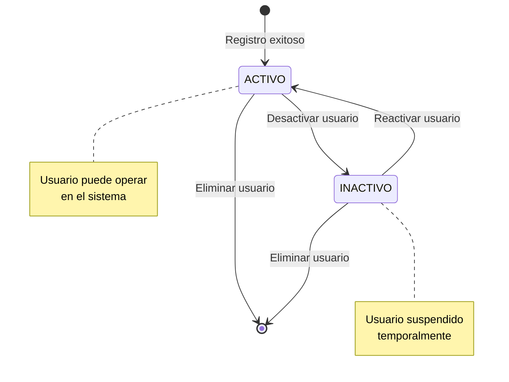
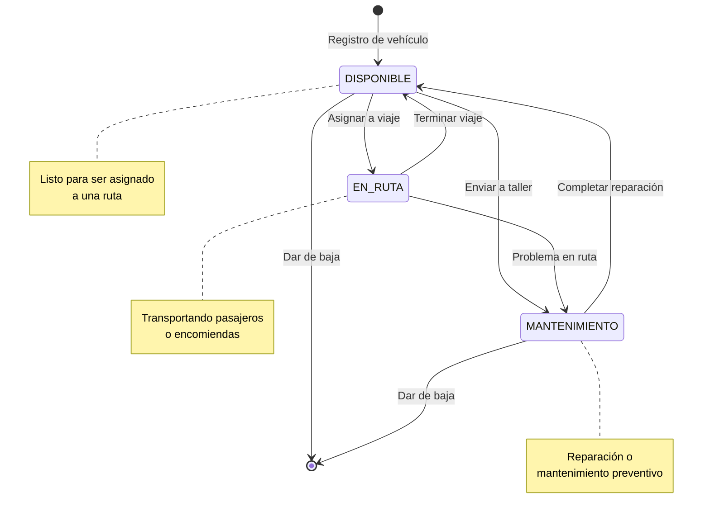
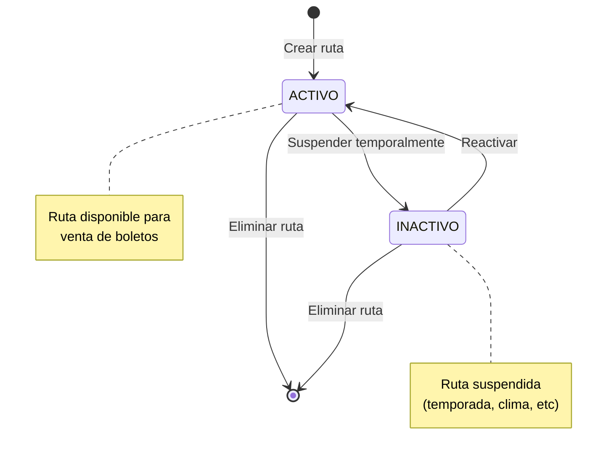
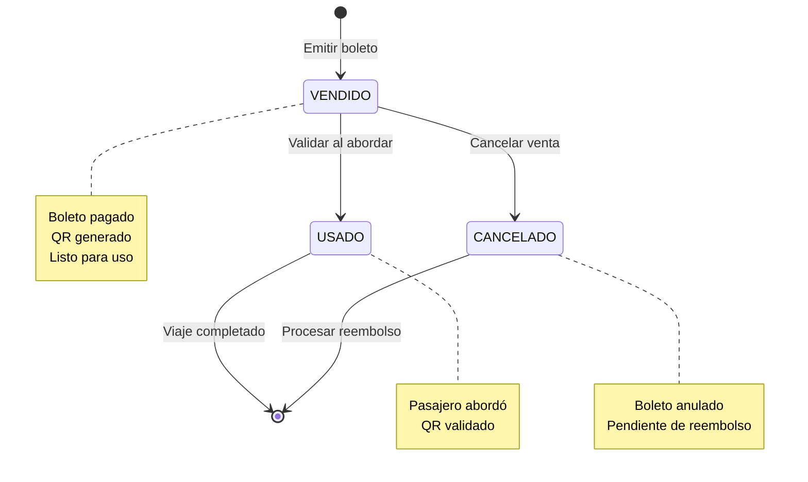
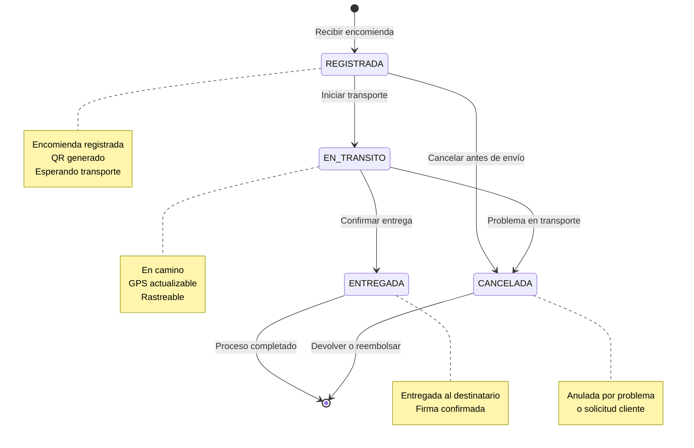
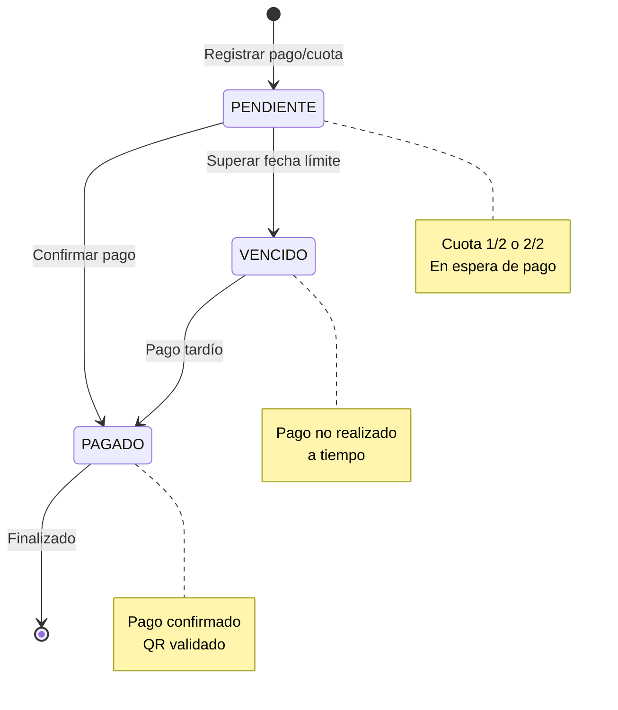
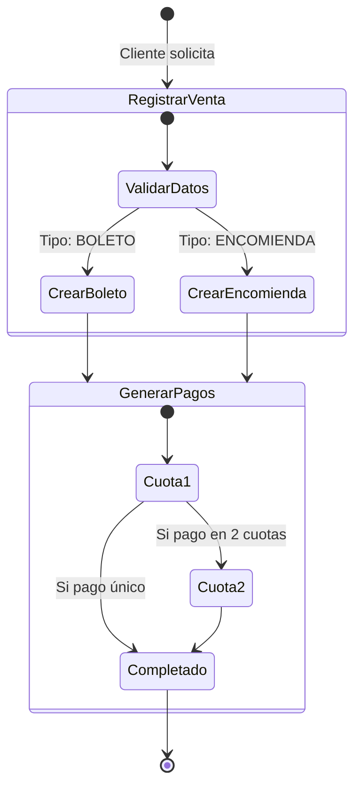
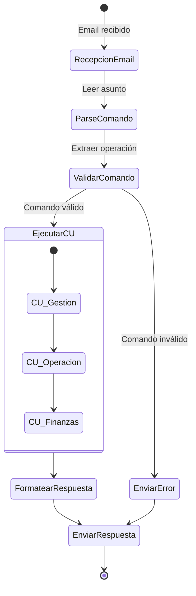

# Diagramas de Estados - Sistema Trans Comarapa

## Diagrama de Estados - Usuario

## Diagrama de Estados - Vehículo

## Diagrama de Estados - Ruta

## Diagrama de Estados - Boleto

## Diagrama de Estados - Encomienda

## Diagrama de Estados - Pago

## Diagrama de Estados Integrado - Venta → Boleto/Encomienda

## Diagrama de Estados - Flujo Completo del Sistema

## Matriz de Transiciones de Estado

### Usuario
| Estado Actual | Evento | Estado Siguiente | Comando |
|---------------|--------|------------------|---------|
| - | Registro | ACTIVO | INSUSU |
| ACTIVO | Desactivar | INACTIVO | UPDUSU[ci,"estado","INACTIVO"] |
| INACTIVO | Reactivar | ACTIVO | UPDUSU[ci,"estado","ACTIVO"] |
| ACTIVO/INACTIVO | Eliminar | [fin] | DELUSU |

### Vehículo
| Estado Actual | Evento | Estado Siguiente | Comando |
|---------------|--------|------------------|---------|
| - | Registro | DISPONIBLE | INSVEH |
| DISPONIBLE | Asignar viaje | EN_RUTA | UPDVEH[placa,"estado","EN_RUTA"] |
| EN_RUTA | Terminar | DISPONIBLE | UPDVEH[placa,"estado","DISPONIBLE"] |
| DISPONIBLE | A taller | MANTENIMIENTO | UPDVEH[placa,"estado","MANTENIMIENTO"] |
| MANTENIMIENTO | Reparado | DISPONIBLE | UPDVEH[placa,"estado","DISPONIBLE"] |

### Boleto
| Estado Actual | Evento | Estado Siguiente | Comando |
|---------------|--------|------------------|---------|
| - | Emitir | VENDIDO | INSBOL |
| VENDIDO | Validar QR | USADO | UPDBOL[codigo,"estado","USADO"] |
| VENDIDO | Cancelar | CANCELADO | UPDBOL[codigo,"estado","CANCELADO"] |

### Encomienda
| Estado Actual | Evento | Estado Siguiente | Comando |
|---------------|--------|------------------|---------|
| - | Registrar | REGISTRADA | INSENC |
| REGISTRADA | Iniciar envío | EN_TRANSITO | UPDENC[codigo,"estado","EN_TRANSITO"] |
| EN_TRANSITO | Entregar | ENTREGADA | UPDENC[codigo,"estado","ENTREGADA"] |
| REGISTRADA/EN_TRANSITO | Cancelar | CANCELADA | UPDENC[codigo,"estado","CANCELADA"] |

### Pago
| Estado Actual | Evento | Estado Siguiente | Comando |
|---------------|--------|------------------|---------|
| - | Registrar | PENDIENTE | INSPAG |
| PENDIENTE | Pagar | PAGADO | UPDPAG[id,"estado","PAGADO"] |
| PENDIENTE | Vencer | VENCIDO | (Automático por fecha) |
| VENCIDO | Pago tardío | PAGADO | UPDPAG[id,"estado","PAGADO"] |

## Reglas de Negocio por Estado

### Vehículo
- ✅ Solo vehículos **DISPONIBLE** pueden asignarse a rutas
- ✅ Vehículos en **MANTENIMIENTO** no aparecen en búsquedas de disponibilidad
- ✅ Cambio a **EN_RUTA** requiere boleto o encomienda asociada

### Boleto
- ✅ Solo boletos **VENDIDO** pueden validarse (cambiar a USADO)
- ✅ Boletos **CANCELADO** no pueden cambiar de estado
- ✅ Generación de QR solo en estado **VENDIDO**

### Encomienda
- ✅ GPS solo actualizable en estado **EN_TRANSITO**
- ✅ Estado **ENTREGADA** es final (no reversible)
- ✅ Código QR generado al crear (estado **REGISTRADA**)

### Pago
- ✅ Solo pagos **PENDIENTE** o **VENCIDO** pueden marcarse como PAGADO
- ✅ Estado **PAGADO** es final
- ✅ Verificación QR solo para pagos **PENDIENTE**
