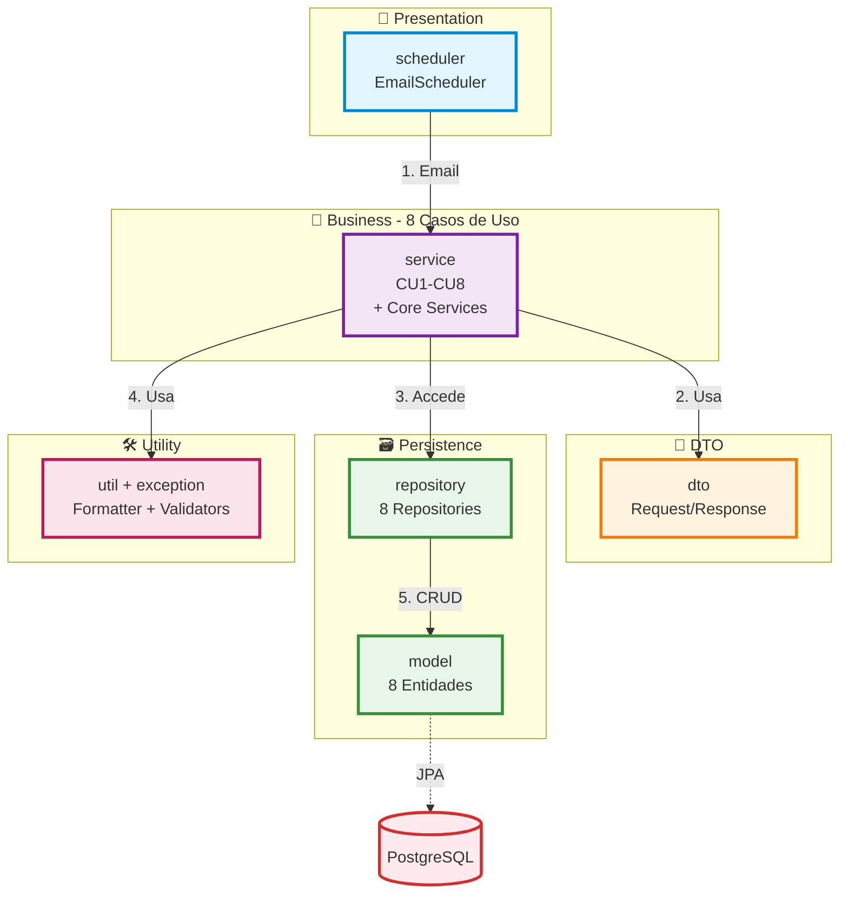
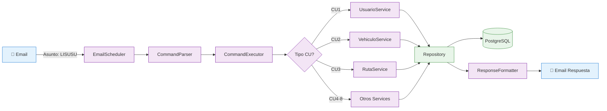

# Diagrama de Paquetes con Casos de Uso - Sistema Trans Comarapa

## Arquitectura de Paquetes con CU Integrados

```mermaid
graph TB
    subgraph "📧 Presentation Layer"
        SCHEDULER[scheduler<br/>EmailScheduler<br/><i>Recepción de comandos</i>]
    end
    
    subgraph "🎯 Business Layer - service"
        CORE[Core Services<br/>Parser + Executor + Email]
        
        subgraph "CU - Gestión Administrativa"
            CU1[UsuarioService<br/><b>CU1: Gestión Usuarios</b><br/>LISUSU, INSUSU, UPDUSU, DELUSU]
            CU2[VehiculoService<br/><b>CU2: Gestión Vehículos</b><br/>LISVEH, INSVEH, UPDVEH, DELVEH]
            CU3[RutaService<br/><b>CU3: Gestión Rutas</b><br/>LISRUT, INSRUT, UPDRUT, DELRUT]
        end
        
        subgraph "CU - Operaciones"
            CU4[BoletoService<br/><b>CU4: Gestión Boletos</b><br/>LISBOL, INSBOL, UPDBOL, DELBOL]
            CU5[EncomiendaService<br/><b>CU5: Gestión Encomiendas</b><br/>LISENC, INSENC, UPDENC, DELENC]
            CU6[VentaService<br/><b>CU6: Gestión Ventas</b><br/>LISVEN, INSVEN]
        end
        
        subgraph "CU - Finanzas"
            CU7[PagoService<br/><b>CU7: Gestión Pagos</b><br/>LISPAG, INSPAG, UPDPAG]
            CU8[ReporteService<br/><b>CU8: Reportes</b><br/>REPREP]
        end
    end
    
    subgraph "💼 DTO Layer"
        DTO[dto<br/>CommandRequest<br/>CommandResponse]
    end
    
    subgraph "🗃️ Persistence Layer"
        subgraph "model"
            M1[Usuario]
            M2[Vehiculo]
            M3[Ruta]
            M4[Boleto]
            M5[Encomienda]
            M6[Venta]
            M7[Pago]
            M8[Reporte]
        end
        
        subgraph "repository"
            R1[UsuarioRepo]
            R2[VehiculoRepo]
            R3[RutaRepo]
            R4[BoletoRepo]
            R5[EncomiendaRepo]
            R6[VentaRepo]
            R7[PagoRepo]
            R8[ReporteRepo]
        end
    end
    
    subgraph "🛠️ Utility Layer"
        UTIL[util + exception<br/>ResponseFormatter<br/>Validators]
    end
    
    DB[(PostgreSQL<br/>db_grupo04sa)]
    
    %% Flujo principal
    SCHEDULER -->|Comando Email| CORE
    CORE -->|Delega a CU| CU1
    CORE -->|Delega a CU| CU2
    CORE -->|Delega a CU| CU3
    CORE -->|Delega a CU| CU4
    CORE -->|Delega a CU| CU5
    CORE -->|Delega a CU| CU6
    CORE -->|Delega a CU| CU7
    CORE -->|Delega a CU| CU8
    
    %% CU usan DTO
    CU1 & CU2 & CU3 & CU4 & CU5 & CU6 & CU7 & CU8 -.->|Usa| DTO
    
    %% CU usan Repositories
    CU1 --> R1
    CU2 --> R2
    CU3 --> R3
    CU4 --> R4
    CU5 --> R5
    CU6 --> R6
    CU7 --> R7
    CU8 --> R8
    
    %% Repositories usan Models
    R1 -.-> M1
    R2 -.-> M2
    R3 -.-> M3
    R4 -.-> M4
    R5 -.-> M5
    R6 -.-> M6
    R7 -.-> M7
    R8 -.-> M8
    
    %% Repositories a DB
    R1 & R2 & R3 & R4 & R5 & R6 & R7 & R8 -.->|JPA| DB
    
    %% Utilities
    CORE & CU1 & CU2 & CU3 & CU4 & CU5 & CU6 & CU7 & CU8 -.->|Usa| UTIL
    
    classDef presentation fill:#e1f5ff,stroke:#0288d1,stroke-width:3px
    classDef core fill:#fff3e0,stroke:#f57c00,stroke-width:3px
    classDef admin fill:#e8f5e9,stroke:#388e3c,stroke-width:2px
    classDef operation fill:#f3e5f5,stroke:#7b1fa2,stroke-width:2px
    classDef finance fill:#ffe0b2,stroke:#ef6c00,stroke-width:2px
    classDef dto fill:#fff9c4,stroke:#f57f17,stroke-width:2px
    classDef persistence fill:#e0f2f1,stroke:#00897b,stroke-width:2px
    classDef utility fill:#fce4ec,stroke:#c2185b,stroke-width:2px
    classDef database fill:#ffcdd2,stroke:#d32f2f,stroke-width:3px
    
    class SCHEDULER presentation
    class CORE core
    class CU1,CU2,CU3 admin
    class CU4,CU5,CU6 operation
    class CU7,CU8 finance
    class DTO dto
    class M1,M2,M3,M4,M5,M6,M7,M8,R1,R2,R3,R4,R5,R6,R7,R8 persistence
    class UTIL utility
    class DB database
```



## Versión Resumida



## Versión Detallada con Flujo



## Mapeo de Casos de Uso a Paquetes

```
com.example.sistema_via_mail/
│
├── 📧 scheduler/                    [Presentation Layer]
│   └── EmailScheduler              - Punto de entrada vía email
│
├── 🎯 service/                      [Business Layer - 8 CU + Core]
│   │
│   ├── Core Services
│   │   ├── CommandParserService    - Analiza comandos
│   │   ├── CommandExecutorService  - Ejecuta y delega a CU
│   │   └── EmailService            - Gestión de correo
│   │
│   ├── CU - Gestión Administrativa
│   │   ├── UsuarioService          - CU1: Gestión de Usuarios
│   │   ├── VehiculoService         - CU2: Gestión de Vehículos  
│   │   └── RutaService             - CU3: Gestión de Rutas
│   │
│   ├── CU - Operaciones
│   │   ├── BoletoService           - CU4: Gestión de Boletos
│   │   ├── EncomiendaService       - CU5: Gestión de Encomiendas
│   │   └── VentaService            - CU6: Gestión de Ventas
│   │
│   └── CU - Finanzas
│       ├── PagoService             - CU7: Gestión de Pagos
│       └── ReporteService          - CU8: Reportes y Estadísticas
│
├── 💼 dto/                          [Data Transfer Objects]
│   ├── CommandRequest              - Request de comandos
│   └── CommandResponse             - Response de comandos
│
├── 🗃️ model/                        [Domain Entities]
│   ├── Usuario                     - Entidad para CU1
│   ├── Vehiculo                    - Entidad para CU2
│   ├── Ruta                        - Entidad para CU3
│   ├── Boleto                      - Entidad para CU4
│   ├── Encomienda                  - Entidad para CU5
│   ├── Venta                       - Entidad para CU6
│   ├── Pago                        - Entidad para CU7
│   └── Reporte                     - Entidad para CU8
│
├── 🗃️ repository/                   [Data Access Layer]
│   ├── UsuarioRepository           - Persistencia CU1
│   ├── VehiculoRepository          - Persistencia CU2
│   ├── RutaRepository              - Persistencia CU3
│   ├── BoletoRepository            - Persistencia CU4
│   ├── EncomiendaRepository        - Persistencia CU5
│   ├── VentaRepository             - Persistencia CU6
│   ├── PagoRepository              - Persistencia CU7
│   └── ReporteRepository           - Persistencia CU8
│
├── 🛠️ util/                         [Utilities]
│   └── ResponseFormatter           - Formatea respuestas
│
└── ⚠️ exception/                    [Exception Handling]
    ├── CommandException            - Excepciones de comandos
    └── ValidationException         - Excepciones de validación
```

## Relación CU → Paquete → Entidad

| Caso de Uso | Service (Lógica) | Repository (Datos) | Model (Entidad) |
|-------------|------------------|-------------------|-----------------|
| **CU1: Usuarios** | UsuarioService | UsuarioRepository | Usuario |
| **CU2: Vehículos** | VehiculoService | VehiculoRepository | Vehiculo |
| **CU3: Rutas** | RutaService | RutaRepository | Ruta |
| **CU4: Boletos** | BoletoService | BoletoRepository | Boleto |
| **CU5: Encomiendas** | EncomiendaService | EncomiendaRepository | Encomienda |
| **CU6: Ventas** | VentaService | VentaRepository | Venta |
| **CU7: Pagos** | PagoService | PagoRepository | Pago |
| **CU8: Reportes** | ReporteService | ReporteRepository | Reporte |

## 🔄 Flujo de Procesamiento

1. **EmailScheduler** revisa correos cada 60 segundos
2. **EmailService** lee el asunto del email
3. **CommandParserService** parsea el comando (ej: LISUSU["*"])
4. **CommandExecutorService** delega al servicio correspondiente
5. **Service específico** ejecuta la lógica de negocio
6. **Repository** accede a PostgreSQL vía JPA
7. **CommandResponse** contiene el resultado
8. **ResponseFormatter** formatea la respuesta
9. **EmailService** envía email al usuario

## 📊 Dependencias entre Capas

```
Presentation → Business → Data Transfer → Persistence → Database
                  ↓              ↓
              Utility      Exception
```
